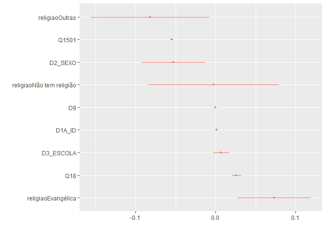

Exercicio 10
================

### Continuaremos com a utilização dos dados do ESEB2018. Carregue o banco da mesma forma que nos exercicios anteriores

``` r
library(tidyverse)
library(haven)

link <- "https://github.com/MartinsRodrigo/Analise-de-dados/blob/master/04622.sav?raw=true"

download.file(link, "04622.sav", mode = "wb")

banco <- read_spss("04622.sav") 

banco <- banco %>%
  mutate(D10 = as_factor(D10)) %>%
  filter(Q18 < 11,
         D9 < 9999998,
         Q1501 < 11,
         Q12P2_B < 3) %>%
  mutate(Q12P2_B = case_when(Q12P2_B == 1 ~ 0,  # Quem votou em Haddad = 0
                             Q12P2_B == 2 ~ 1)) # Quem votou em Bolsonaro = 1
```

### Crie a mesma variável de religião utilizada no exercício anterior

``` r
Outras <- levels(banco$D10)[-c(3,5,13)]

banco <- banco %>%
  mutate(religiao = case_when(D10 %in% Outras ~ "Outras",
                              D10 == "Católica" ~ "Católica",
                              D10 == "Evangélica" ~ "Evangélica",
                              D10 == "Não tem religião" ~ "Não tem religião"))
```

### Faça uma regressão linear utilizando as mesmas variáveis do exercício 9 - idade(D1A\_ID), educação (D3\_ESCOLA), renda (D9), nota atribuída ao PT (Q1501), auto-atribuição ideológica (Q18), sexo (D2\_SEXO) e religião (variável criada no passo anterior) - explicam o voto em Bolsonaro (Q12P2\_B).

``` r
 regressao <- lm(Q12P2_B ~ D3_ESCOLA + D1A_ID + D9 + Q1501 + Q18 + D2_SEXO + religiao, data = banco)

summary(regressao)
```

    ## 
    ## Call:
    ## lm(formula = Q12P2_B ~ D3_ESCOLA + D1A_ID + D9 + Q1501 + Q18 + 
    ##     D2_SEXO + religiao, data = banco)
    ## 
    ## Residuals:
    ##      Min       1Q   Median       3Q      Max 
    ## -1.05532 -0.19854  0.01565  0.16182  0.96682 
    ## 
    ## Coefficients:
    ##                            Estimate Std. Error t value Pr(>|t|)    
    ## (Intercept)               7.067e-01  6.469e-02  10.924  < 2e-16 ***
    ## D3_ESCOLA                 5.547e-03  5.226e-03   1.061  0.28873    
    ## D1A_ID                    1.140e-03  7.539e-04   1.512  0.13074    
    ## D9                       -9.837e-07  3.196e-06  -0.308  0.75832    
    ## Q1501                    -7.728e-02  2.799e-03 -27.610  < 2e-16 ***
    ## Q18                       2.651e-02  3.093e-03   8.570  < 2e-16 ***
    ## D2_SEXO                  -5.286e-02  2.089e-02  -2.530  0.01154 *  
    ## religiaoEvangélica        7.684e-02  2.363e-02   3.251  0.00118 ** 
    ## religiaoNão tem religião -2.746e-03  4.238e-02  -0.065  0.94835    
    ## religiaoOutras           -7.263e-02  3.678e-02  -1.975  0.04855 *  
    ## ---
    ## Signif. codes:  0 '***' 0.001 '**' 0.01 '*' 0.05 '.' 0.1 ' ' 1
    ## 
    ## Residual standard error: 0.3489 on 1138 degrees of freedom
    ## Multiple R-squared:  0.5028, Adjusted R-squared:  0.4989 
    ## F-statistic: 127.9 on 9 and 1138 DF,  p-value: < 2.2e-16

### Interprete o resultado dos coeficientes

A regressão obteve diversos resultados significantes. Com base nesse
banco de dados utilizado é possível afirmar que há uma correlação
negativa entre a opinião do entrevistado sobre o PT e o voto no
candidato Bolsonaro no 2º turno, há também correlação positiva entre a
variável de auto-atribuição ideológica e o voto no 2º turno, como nessa
variável (Q18) os valores mais altos significam maior identificação com
a “direita” tem-se que quanto mais o entrevistado se identifica com a
direita maior a probabilidade dele votar ter votado em Bolsonaro.

Já no que se refere às variáveis categóricas é possível observar que há
uma correlação negativa com essa variável (1 = masculino e 2 = feminino
no banco de dados), isso significa que mulheres tendiam a votar menos em
Bolsonaro em 2018.

Quanto a variável de religião ela nos mostra o seguinte: a categoria de
referência (católicos) tendeu a votar em Bolsonaro já que o intercepto é
positivo e significante (0.706). Evangélicos apresentaram maior apoio a
Bolsonaro que católicos (+0.076), enquanto os entrevistados que
professavam outras religiões votaram menos no candidato que os católicos
(-0.072).

Outras variáveis não apresentaram resultados significantes. O R² da
regressão foi razoável (50%).

### O resultado difere dos encontrados anteriormente, quando a variavel dependente era a aprovação de Bolsonaro?

Em parte sim. A avaliação de Bolsonaro apresentava uma relação
significativa com a escolaridade (-0.11) e a idade (+0.01) do
entrevistado, variáveis que não apresentaram significância na regressão
com a intenção de voto no 2º turno (a variável idade teve um p-valor
baixo, mas ainda acima de 0.1).

Já o grupo de evangélicos, que votou mais em Bolsonaro que os católicos,
não apresentava uma diferença significativa do grupo de referência na
regressão realizada no último exercício, ou seja, evangélicos e
católicos avaliavam Bolsonaro de forma similar (aprox. 6.11).

Além disso o R² da regressão do voto foi bem maior que o da regressão da
avaliação, o que indica uma maior importância dessas variáveis
analisadas no voto de segundo turno do que na avaliação do candidato.

### Faça uma regressão logistica com as mesmas variaveis

``` r
#install.packages("psc1")
#library(psc1)

regressaolog <- glm(Q12P2_B ~ D3_ESCOLA + D1A_ID + D9 + Q1501 + Q18 + D2_SEXO + religiao, data = banco, family = "binomial")

summary(regressaolog)
```

    ## 
    ## Call:
    ## glm(formula = Q12P2_B ~ D3_ESCOLA + D1A_ID + D9 + Q1501 + Q18 + 
    ##     D2_SEXO + religiao, family = "binomial", data = banco)
    ## 
    ## Deviance Residuals: 
    ##     Min       1Q   Median       3Q      Max  
    ## -2.7529  -0.5625   0.2518   0.4744   2.5830  
    ## 
    ## Coefficients:
    ##                            Estimate Std. Error z value Pr(>|z|)    
    ## (Intercept)               8.209e-01  5.298e-01   1.550  0.12124    
    ## D3_ESCOLA                 5.634e-02  4.358e-02   1.293  0.19602    
    ## D1A_ID                    1.001e-02  6.337e-03   1.580  0.11405    
    ## D9                       -4.635e-06  2.396e-05  -0.193  0.84660    
    ## Q1501                    -4.678e-01  2.666e-02 -17.545  < 2e-16 ***
    ## Q18                       2.242e-01  2.748e-02   8.159 3.37e-16 ***
    ## D2_SEXO                  -4.497e-01  1.739e-01  -2.586  0.00971 ** 
    ## religiaoEvangélica        6.217e-01  1.985e-01   3.132  0.00173 ** 
    ## religiaoNão tem religião -2.106e-02  3.478e-01  -0.061  0.95172    
    ## religiaoOutras           -6.736e-01  3.122e-01  -2.158  0.03096 *  
    ## ---
    ## Signif. codes:  0 '***' 0.001 '**' 0.01 '*' 0.05 '.' 0.1 ' ' 1
    ## 
    ## (Dispersion parameter for binomial family taken to be 1)
    ## 
    ##     Null deviance: 1557.84  on 1147  degrees of freedom
    ## Residual deviance:  862.45  on 1138  degrees of freedom
    ## AIC: 882.45
    ## 
    ## Number of Fisher Scoring iterations: 5

### Transforme os coeficientes estimados em probabilidade

``` r
library(margins)
library(dotwhisker)

margins(regressaolog)
```

    ##  D3_ESCOLA   D1A_ID         D9    Q1501     Q18 D2_SEXO religiaoEvangélica
    ##   0.006589 0.001171 -5.421e-07 -0.05471 0.02622 -0.0526            0.07346
    ##  religiaoNão tem religião religiaoOutras
    ##                 -0.002521       -0.08172

``` r
summary(margins(regressaolog))
```

    ##                    factor     AME     SE        z      p   lower   upper
    ##                    D1A_ID  0.0012 0.0007   1.5849 0.1130 -0.0003  0.0026
    ##                   D2_SEXO -0.0526 0.0202  -2.6078 0.0091 -0.0921 -0.0131
    ##                 D3_ESCOLA  0.0066 0.0051   1.2949 0.1953 -0.0034  0.0166
    ##                        D9 -0.0000 0.0000  -0.1935 0.8466 -0.0000  0.0000
    ##                     Q1501 -0.0547 0.0009 -57.9079 0.0000 -0.0566 -0.0529
    ##                       Q18  0.0262 0.0030   8.8434 0.0000  0.0204  0.0320
    ##        religiaoEvangélica  0.0735 0.0235   3.1280 0.0018  0.0274  0.1195
    ##  religiaoNão tem religião -0.0025 0.0417  -0.0605 0.9517 -0.0842  0.0791
    ##            religiaoOutras -0.0817 0.0379  -2.1574 0.0310 -0.1560 -0.0075

``` r
efeito <- summary(margins(regressaolog))%>%
  rename(term=factor,
         estimate = AME,
         std.error = SE,
         statistic = z,
         p.value = p) %>% arrange(estimate)

dwplot(efeito)
```

<!-- -->

### Quais foram as diferenças no resultado entre usar a regressão linear e a logistica?

Houveram poucas mudanças nos resultados obtidos.

Os coeficientes significantes na regressão linear se mantiveram
significantes nos resultados de probabilidade da regressão logística, o
mesmo vale para os coeficientes que não atingiram tal exigência de
p-valor.

Os resultados apresentados quando transformamos os coeficientes da
regressão logística em probabilidade foram: **-5,26%** de chance de uma
mulher votar em Bolsonaro se comparadas aos homens; **-5,47%** de chance
de se votar em Bolsonaro a cada valor positivo apresentado para o PT na
variável acerca da opinião sobre o partido; **+2,62%** de chance de o
entrevistado declara voto em Bolsonaro a cada valor positivo para a
autoidentificação partidária pró-direita; **+7,35%** de chance de um
evangélico ter votado em Bolsonaro (se comparado com um católico);
**-8,17%** de chance de algém que professe outra religião (que não
católica e evangélica) de ter votado em Bolsonaro, se comparados aos
católicos.

### Verifique a quantidade de classificações corretas da regressao logistica e avalie o resultado

``` r
library(InformationValue)

predictprob <- predict(regressaolog, type = "response")

opt_cutoff <- optimalCutoff(banco$Q12P2_B, predictprob)

misClassError(banco$Q12P2_B, predictprob, threshold = opt_cutoff)
```

    ## [1] 0.1638

``` r
prop.table(confusionMatrix(banco$Q12P2_B, predictprob, threshold = opt_cutoff))
```

    ##            0          1
    ## 0 0.34233449 0.09146341
    ## 1 0.07229965 0.49390244

É possível observar que o modelo possui uma capacidade de predição
razoável, mas não muito alta. Aproximadamente 84% dos valores preditos
acertaram na predição, enquanto aproximadamente 16% indicaram a escolha
do candidato no segundo turno de forma errônea. A predição acabou se
mostrando mais pró-Bolsonaro, prevendo 59,5% dos votos para o candidato,
enquanto apenas 56,5% dos entrevistados afirmaram votar no candidato no
segundo turno. Se utilizarmos do modelo ingênuo para conseguir o
resultado da redução proporcional do erro descobrimos uma diminuição de
aproximadamente 62,5% nos erros preditos.
