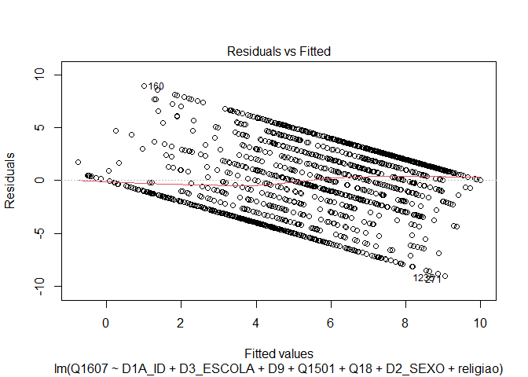
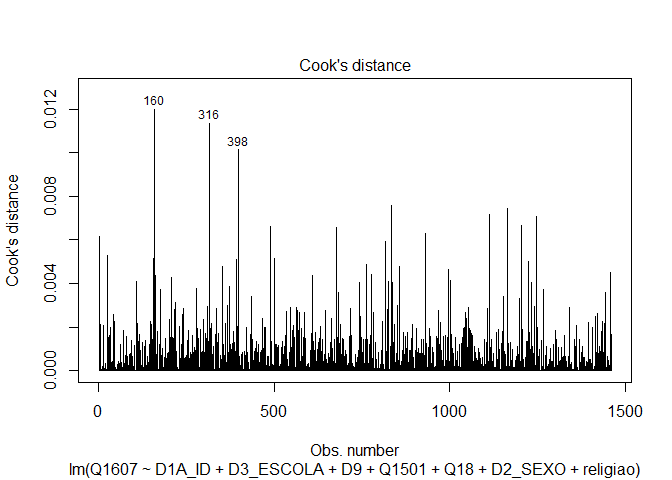
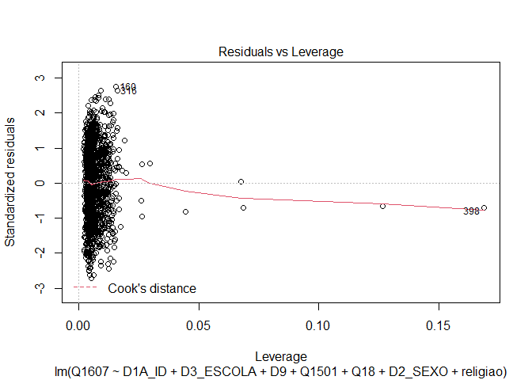

Exercicio 11
================

``` r
library(tidyverse)
library(haven)
library(lmtest)
library(car)
library(sandwich)

link <- "https://github.com/MartinsRodrigo/Analise-de-dados/blob/master/04622.sav?raw=true"

download.file(link, "04622.sav", mode = "wb")

banco <- read_spss("04622.sav") 

banco <- banco %>%
  mutate(D10 = as_factor(D10)) %>%
  filter(Q1607 < 11, 
         Q18 < 11,
         D9 < 9999998,
         Q1501 < 11)


Outras <- levels(banco$D10)[-c(3,5,13)]

banco <- banco %>%
  mutate(religiao = case_when(D10 %in% Outras ~ "Outras",
                              D10 == "Católica" ~ "Católica",
                              D10 == "Evangélica" ~ "Evangélica",
                              D10 == "Não tem religião" ~ "Não tem religião"))
```

### Faça uma regressão linear avaliando em que medida as variáveis independentes utilizadas nos exercícios 7 e 8, idade(D1A\_ID), educação (D3\_ESCOLA), renda (D9), nota atribuída ao PT (Q1501), auto-atribuição ideológica (Q18), sexo (D2\_SEXO) e religião (variável criada no passo anterior) explicam a avaliação de Bolsonaro (Q1607)

``` r
regressão <- lm(Q1607 ~ D1A_ID + D3_ESCOLA + D9 + Q1501 + Q18 + D2_SEXO + religiao, data = banco)

summary(regressão)
```

    ## 
    ## Call:
    ## lm(formula = Q1607 ~ D1A_ID + D3_ESCOLA + D9 + Q1501 + Q18 + 
    ##     D2_SEXO + religiao, data = banco)
    ## 
    ## Residuals:
    ##     Min      1Q  Median      3Q     Max 
    ## -9.0608 -2.5654  0.4179  2.3268  8.9954 
    ## 
    ## Coefficients:
    ##                            Estimate Std. Error t value Pr(>|t|)    
    ## (Intercept)               6.216e+00  5.365e-01  11.586  < 2e-16 ***
    ## D1A_ID                    1.040e-02  6.234e-03   1.669 0.095376 .  
    ## D3_ESCOLA                -1.116e-01  4.486e-02  -2.487 0.012982 *  
    ## D9                       -3.620e-05  2.764e-05  -1.309 0.190576    
    ## Q1501                    -3.946e-01  2.367e-02 -16.670  < 2e-16 ***
    ## Q18                       3.161e-01  2.603e-02  12.142  < 2e-16 ***
    ## D2_SEXO                  -6.874e-01  1.746e-01  -3.937 8.63e-05 ***
    ## religiaoEvangélica        6.685e-01  1.984e-01   3.370 0.000772 ***
    ## religiaoNão tem religião -7.565e-02  3.485e-01  -0.217 0.828177    
    ## religiaoOutras           -8.326e-01  3.081e-01  -2.702 0.006963 ** 
    ## ---
    ## Signif. codes:  0 '***' 0.001 '**' 0.01 '*' 0.05 '.' 0.1 ' ' 1
    ## 
    ## Residual standard error: 3.296 on 1452 degrees of freedom
    ## Multiple R-squared:  0.3018, Adjusted R-squared:  0.2975 
    ## F-statistic: 69.75 on 9 and 1452 DF,  p-value: < 2.2e-16

A partir da regressão pode-se observar a influência das variáveis de
autoatribuição ideológica, idade, escolaridade, opinião sobre o PT, sexo
e religião na avaliação de Bolsonaro.

Enquanto a idade e o posicionamento mais a direita tem correlação
positiva com a avaliação do candidato, as variáveis escolaridade e
opinião sobre o PT possuem uma correlação negativa com a opinião sobre
Bolsonaro.

Já no que se refere às variáveis categóricas é possível notar que as
mulheres (1) avaliam o candidato em média com menos 0.68 pontos que os
homens (2) entrevistados. Além disso, os evagélicos avaliam o candidato
em média 0.66 pontos a mais que os católicos (categoria de referência),
enquanto as pessoas que se enquadram em outras religiões avaliavam o
candidato em -0.83 pontos se comparados com a mesma categoria.

### Faça o teste de homoscedasticidade do modelo e corrija as estimações dos coeficientes caso seja necessário.

``` r
plot(regressão, 3)
```

<!-- -->

``` r
plot(regressão, 1)
```

<!-- -->

``` r
bptest(regressão)
```

    ## 
    ##  studentized Breusch-Pagan test
    ## 
    ## data:  regressão
    ## BP = 65.763, df = 9, p-value = 1.025e-10

``` r
ncvTest(regressão)
```

    ## Non-constant Variance Score Test 
    ## Variance formula: ~ fitted.values 
    ## Chisquare = 22.48512, Df = 1, p = 2.1178e-06

``` r
coeftest(regressão, vcov. = vcovHC(regressão))
```

    ## 
    ## t test of coefficients:
    ## 
    ##                             Estimate  Std. Error  t value  Pr(>|t|)    
    ## (Intercept)               6.2160e+00  5.4715e-01  11.3607 < 2.2e-16 ***
    ## D1A_ID                    1.0403e-02  6.2657e-03   1.6603 0.0970600 .  
    ## D3_ESCOLA                -1.1159e-01  4.7247e-02  -2.3619 0.0183123 *  
    ## D9                       -3.6198e-05  3.6481e-05  -0.9922 0.3212463    
    ## Q1501                    -3.9464e-01  2.6381e-02 -14.9593 < 2.2e-16 ***
    ## Q18                       3.1608e-01  2.8534e-02  11.0772 < 2.2e-16 ***
    ## D2_SEXO                  -6.8736e-01  1.7967e-01  -3.8256 0.0001360 ***
    ## religiaoEvangélica        6.6854e-01  1.9676e-01   3.3978 0.0006978 ***
    ## religiaoNão tem religião -7.5647e-02  3.7488e-01  -0.2018 0.8401094    
    ## religiaoOutras           -8.3256e-01  3.0592e-01  -2.7215 0.0065759 ** 
    ## ---
    ## Signif. codes:  0 '***' 0.001 '**' 0.01 '*' 0.05 '.' 0.1 ' ' 1

A partir dos gráficos obtidos e dos testes realizados é possível
concluir que o banco de dados analisado é heterocedástico. Os testes
bptest e ncvTest obtiveram p-valores baixos, sendo que a hipótese nula é
a homocedasticidade do banco de dados, sendo assim um p-valor baixo
significa um banco de dados heterocedástico.

No entanto, é possível observar que a correção dos valores através do
coeftest não altera os resultados obtidos anteriormente. Ou seja, mesmo
com heterocedasticidade as correlações são confiáveis.

### Avalie a multicolinearidade entre as variáveis

``` r
vif(regressão)
```

    ##               GVIF Df GVIF^(1/(2*Df))
    ## D1A_ID    1.219401  1        1.104265
    ## D3_ESCOLA 1.337368  1        1.156446
    ## D9        1.094849  1        1.046350
    ## Q1501     1.119818  1        1.058215
    ## Q18       1.049195  1        1.024302
    ## D2_SEXO   1.023001  1        1.011435
    ## religiao  1.093846  3        1.015062

Foi utilizado a função vif para observar se há multicolinearidade, e
como pode se observar não foi encontrada multicoliearidade entre as
variáveis, já que todos os resultados foram próximos de 1.

### Verifique a presença de outilier ou observações influentes no modelo

``` r
plot(regressão,4)
```

<!-- -->

``` r
plot(regressão,5)
```

<!-- -->

``` r
outlierTest(regressão)
```

    ## No Studentized residuals with Bonferroni p < 0.05
    ## Largest |rstudent|:
    ##     rstudent unadjusted p-value Bonferroni p
    ## 271 -2.76344          0.0057918           NA

A partir dos gráficos e do teste realizado é possível concluir **não**
há um outlier que influencie a regressão significativamente, pois o
p-valor obtido no teste foi baixo e os gráficos não indicaram um objeto
capaz de inflienciar no resultado da regressão.

### Faça a regressao linear sem a observação mais influente e avalie a alteração do resultado

``` r
banco <- banco %>% slice(-c(1442, 271))

regressão <- lm(Q1607 ~ D1A_ID + D3_ESCOLA + D9 + Q1501 + Q18 + D2_SEXO + religiao, data = banco)
summary(regressão)
```

    ## 
    ## Call:
    ## lm(formula = Q1607 ~ D1A_ID + D3_ESCOLA + D9 + Q1501 + Q18 + 
    ##     D2_SEXO + religiao, data = banco)
    ## 
    ## Residuals:
    ##     Min      1Q  Median      3Q     Max 
    ## -8.8907 -2.4728  0.3936  2.3023  8.9859 
    ## 
    ## Coefficients:
    ##                            Estimate Std. Error t value Pr(>|t|)    
    ## (Intercept)               6.219e+00  5.348e-01  11.628  < 2e-16 ***
    ## D1A_ID                    1.173e-02  6.230e-03   1.882 0.060018 .  
    ## D3_ESCOLA                -1.050e-01  4.495e-02  -2.336 0.019610 *  
    ## D9                       -6.535e-05  3.064e-05  -2.133 0.033094 *  
    ## Q1501                    -3.993e-01  2.364e-02 -16.888  < 2e-16 ***
    ## Q18                       3.168e-01  2.595e-02  12.211  < 2e-16 ***
    ## D2_SEXO                  -6.945e-01  1.743e-01  -3.984 7.12e-05 ***
    ## religiaoEvangélica        7.000e-01  1.979e-01   3.537 0.000418 ***
    ## religiaoNão tem religião -6.171e-02  3.473e-01  -0.178 0.859001    
    ## religiaoOutras           -8.134e-01  3.071e-01  -2.649 0.008169 ** 
    ## ---
    ## Signif. codes:  0 '***' 0.001 '**' 0.01 '*' 0.05 '.' 0.1 ' ' 1
    ## 
    ## Residual standard error: 3.285 on 1450 degrees of freedom
    ## Multiple R-squared:  0.3064, Adjusted R-squared:  0.3021 
    ## F-statistic: 71.18 on 9 and 1450 DF,  p-value: < 2.2e-16

``` r
plot(regressão,4)
```

<!-- -->

``` r
plot(regressão,5)
```

<!-- -->

``` r
outlierTest(regressão)
```

    ## No Studentized residuals with Bonferroni p < 0.05
    ## Largest |rstudent|:
    ##     rstudent unadjusted p-value Bonferroni p
    ## 160 2.763305          0.0057943           NA

Após a retirada de dois outliers (um apresentado pelos gráficos e outro
apresentado pelo outliertest) verifica-se que alguns coeficientes se
tornaram significativos (p-valor menor) do que com a inclusão dos
outliers.

O primeiro coeficiente a se observar é o referente a renda (D9), que não
apresentava significância anteriormente e agora apresenta p-valor de
0.03. Os p-valores relativos aos coeficientes das variáveis idade, sexo
e escolaridade também diminuíram.
