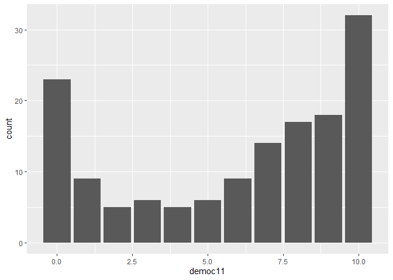
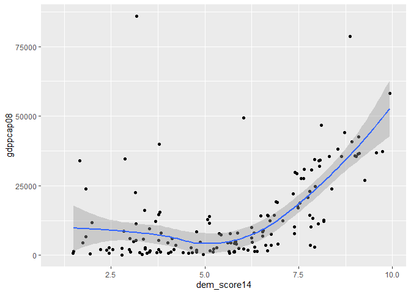
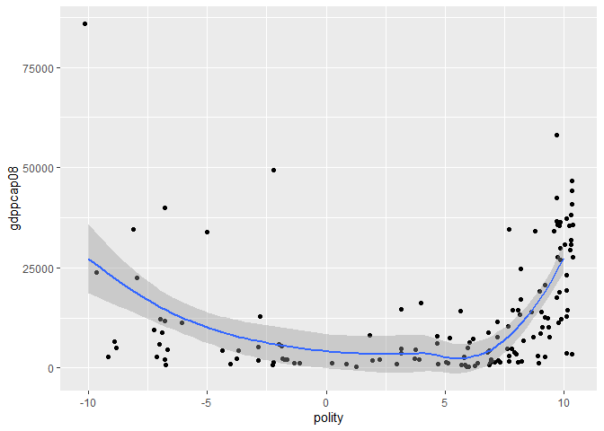

Exercicio 5
================
Ulisses Matheus

### Carregue o banco de dados `world` que está no pacote `poliscidata`.

``` r
library(poliscidata)
```

    ## Warning: package 'poliscidata' was built under R version 4.0.2

``` r
banco <- world
```

### Existem diversas medidas de democracia para os países: `dem_score14`, `democ11`, `fhrate04_rev`, `fhrate08_rev`, `polity`. Descreva-as graficamente e diga quais são as diferenças entre tais medidas.

Utilizei gráficos de barras e historiograma nas variáveis para
representar o número de países com avaliações correspondetes. As
variáveis possuem, inclusive, resultados próximos, é possível oservar,
por exemplo, uma alta concentração de países no “topo” de cada ranking.
A principal diferença entre cada variável, contudo, é a quantificação da
avaliação. A variável “polity”, por exemplo, utiliza numerais negativos
em seu ranking, enquanto todas as outras usam apenas positivos. Já a
“dem\_score14” detalha sua avalição até a casa dos centésimos (o que
permitiu uma melhor adaptação do historiograma), e também aparenta se
mais criterioso em sua avaliação, tendo em vista uma menosr concentração
nas avaliações mais altas.

``` r
library(tidyverse)
```

    ## -- Attaching packages --------------------------------------------------- tidyverse 1.3.0 --

    ## v ggplot2 3.3.2     v purrr   0.3.4
    ## v tibble  3.0.1     v dplyr   1.0.0
    ## v tidyr   1.1.0     v stringr 1.4.0
    ## v readr   1.3.1     v forcats 0.5.0

    ## -- Conflicts ------------------------------------------------------ tidyverse_conflicts() --
    ## x dplyr::filter() masks stats::filter()
    ## x dplyr::lag()    masks stats::lag()

``` r
ggplot(banco, aes(dem_score14)) + geom_histogram(binwidth = 0.3)
```

<!-- -->

``` r
ggplot(banco, aes(democ11)) + geom_bar()
```

    ## Warning: Removed 23 rows containing non-finite values (stat_count).

<!-- -->

``` r
ggplot(banco, aes(fhrate04_rev)) + geom_bar()
```

    ## Warning: Removed 14 rows containing non-finite values (stat_count).

<!-- -->

``` r
ggplot(banco, aes(fhrate08_rev)) + geom_bar()
```

    ## Warning: Removed 15 rows containing non-finite values (stat_count).

<!-- -->

``` r
ggplot(banco, aes(polity)) + geom_bar()
```

    ## Warning: Removed 23 rows containing non-finite values (stat_count).

<!-- -->

### Avalie a relação entre tais medidas de democracia e desigualdade, utilizando a variável `gini08`. Descreva graficamente esta variável, a relação entre as duas variáveis, meça a correlação entre elas e faça regressões lineares (interpretando em profundidade os resultados dos coeficientes e medidas de desempenho dos modelos). Enfatize as semelhanças e diferenças entre os resultados. Quais são suas conclusões?

## dem\_score14 x gini08

``` r
regressaoscore14 <- lm(dem_score14 ~ gini08, data = banco)
summary(regressaoscore14)
```

    ## 
    ## Call:
    ## lm(formula = dem_score14 ~ gini08, data = banco)
    ## 
    ## Residuals:
    ##     Min      1Q  Median      3Q     Max 
    ## -4.0728 -1.7583  0.3513  1.6742  3.3600 
    ## 
    ## Coefficients:
    ##             Estimate Std. Error t value Pr(>|t|)    
    ## (Intercept)  7.71756    0.75639  10.203   <2e-16 ***
    ## gini08      -0.04448    0.01807  -2.462   0.0152 *  
    ## ---
    ## Signif. codes:  0 '***' 0.001 '**' 0.01 '*' 0.05 '.' 0.1 ' ' 1
    ## 
    ## Residual standard error: 2.003 on 120 degrees of freedom
    ##   (45 observations deleted due to missingness)
    ## Multiple R-squared:  0.04809,    Adjusted R-squared:  0.04015 
    ## F-statistic: 6.062 on 1 and 120 DF,  p-value: 0.01523

``` r
ggplot(banco, aes(dem_score14, gini08)) + geom_jitter() + geom_smooth()
```

    ## `geom_smooth()` using method = 'loess' and formula 'y ~ x'

    ## Warning: Removed 45 rows containing non-finite values (stat_smooth).

    ## Warning: Removed 45 rows containing missing values (geom_point).

<!-- -->

## democ11 x gini08

``` r
regressaodemoc11 <- lm(democ11 ~ gini08, data = banco)
summary(regressaodemoc11)
```

    ## 
    ## Call:
    ## lm(formula = democ11 ~ gini08, data = banco)
    ## 
    ## Residuals:
    ##    Min     1Q Median     3Q    Max 
    ## -6.796 -2.213  1.302  3.049  3.958 
    ## 
    ## Coefficients:
    ##             Estimate Std. Error t value Pr(>|t|)    
    ## (Intercept)  7.68568    1.38306   5.557 1.85e-07 ***
    ## gini08      -0.02994    0.03311  -0.904    0.368    
    ## ---
    ## Signif. codes:  0 '***' 0.001 '**' 0.01 '*' 0.05 '.' 0.1 ' ' 1
    ## 
    ## Residual standard error: 3.47 on 113 degrees of freedom
    ##   (52 observations deleted due to missingness)
    ## Multiple R-squared:  0.007186,   Adjusted R-squared:  -0.0016 
    ## F-statistic: 0.8179 on 1 and 113 DF,  p-value: 0.3677

``` r
ggplot(banco, aes(democ11, gini08)) + geom_jitter() + geom_smooth()
```

    ## `geom_smooth()` using method = 'loess' and formula 'y ~ x'

    ## Warning: Removed 52 rows containing non-finite values (stat_smooth).

    ## Warning: Removed 52 rows containing missing values (geom_point).

<!-- -->

\#\#fhrate04\_rev x gini08

``` r
regressaofhrate04 <- lm(fhrate04_rev ~ gini08, data = banco)
summary(regressaofhrate04)
```

    ## 
    ## Call:
    ## lm(formula = fhrate04_rev ~ gini08, data = banco)
    ## 
    ## Residuals:
    ##     Min      1Q  Median      3Q     Max 
    ## -3.8312 -1.3896  0.4312  1.6729  2.6199 
    ## 
    ## Coefficients:
    ##             Estimate Std. Error t value Pr(>|t|)    
    ## (Intercept)  6.13654    0.67419   9.102 2.35e-15 ***
    ## gini08      -0.03199    0.01610  -1.987   0.0492 *  
    ## ---
    ## Signif. codes:  0 '***' 0.001 '**' 0.01 '*' 0.05 '.' 0.1 ' ' 1
    ## 
    ## Residual standard error: 1.786 on 120 degrees of freedom
    ##   (45 observations deleted due to missingness)
    ## Multiple R-squared:  0.03185,    Adjusted R-squared:  0.02378 
    ## F-statistic: 3.948 on 1 and 120 DF,  p-value: 0.04921

``` r
ggplot(banco, aes(fhrate04_rev, gini08)) + geom_jitter() + geom_smooth()
```

    ## `geom_smooth()` using method = 'loess' and formula 'y ~ x'

    ## Warning: Removed 45 rows containing non-finite values (stat_smooth).

    ## Warning: Removed 45 rows containing missing values (geom_point).

<!-- -->

## fhrate08\_rev x gini08

``` r
regressaofhrate08 <- lm(fhrate08_rev ~ gini08, data = banco)
summary(regressaofhrate08)
```

    ## 
    ## Call:
    ## lm(formula = fhrate08_rev ~ gini08, data = banco)
    ## 
    ## Residuals:
    ##     Min      1Q  Median      3Q     Max 
    ## -7.9157 -2.5971  0.6712  3.4091  5.0961 
    ## 
    ## Coefficients:
    ##             Estimate Std. Error t value Pr(>|t|)    
    ## (Intercept)  9.97288    1.34188   7.432 1.79e-11 ***
    ## gini08      -0.05590    0.03207  -1.743   0.0839 .  
    ## ---
    ## Signif. codes:  0 '***' 0.001 '**' 0.01 '*' 0.05 '.' 0.1 ' ' 1
    ## 
    ## Residual standard error: 3.554 on 119 degrees of freedom
    ##   (46 observations deleted due to missingness)
    ## Multiple R-squared:  0.0249, Adjusted R-squared:  0.01671 
    ## F-statistic: 3.039 on 1 and 119 DF,  p-value: 0.08387

``` r
ggplot(banco, aes(fhrate08_rev, gini08)) + geom_jitter() + geom_smooth()
```

    ## `geom_smooth()` using method = 'loess' and formula 'y ~ x'

    ## Warning: Removed 46 rows containing non-finite values (stat_smooth).

    ## Warning: Removed 46 rows containing missing values (geom_point).

<!-- -->

## polity x gini08

``` r
regressaopolity <- lm(polity ~ gini08, data = banco)
summary(regressaopolity)
```

    ## 
    ## Call:
    ## lm(formula = polity ~ gini08, data = banco)
    ## 
    ## Residuals:
    ##     Min      1Q  Median      3Q     Max 
    ## -14.374  -1.300   2.364   4.087   5.040 
    ## 
    ## Coefficients:
    ##             Estimate Std. Error t value Pr(>|t|)   
    ## (Intercept)  6.21813    2.20594   2.819  0.00569 **
    ## gini08      -0.02292    0.05280  -0.434  0.66499   
    ## ---
    ## Signif. codes:  0 '***' 0.001 '**' 0.01 '*' 0.05 '.' 0.1 ' ' 1
    ## 
    ## Residual standard error: 5.535 on 113 degrees of freedom
    ##   (52 observations deleted due to missingness)
    ## Multiple R-squared:  0.001665,   Adjusted R-squared:  -0.007169 
    ## F-statistic: 0.1885 on 1 and 113 DF,  p-value: 0.665

``` r
confint(regressaopolity, level = 0.95)
```

    ##                  2.5 %      97.5 %
    ## (Intercept)  1.8477696 10.58848167
    ## gini08      -0.1275342  0.08168441

``` r
ggplot(banco, aes(polity, gini08)) + geom_jitter() + geom_smooth()
```

    ## `geom_smooth()` using method = 'loess' and formula 'y ~ x'

    ## Warning: Removed 52 rows containing non-finite values (stat_smooth).

    ## Warning: Removed 52 rows containing missing values (geom_point).

<!-- -->

Apesar da grande similaridade entre os gráficos (que descrevem uma lenta
e pequena queda inicial, seguida por uma ascensão da linha quase tão
tímida quanto a queda anterior e, por fim, mais uma queda, desta vez
bastante agressiva) alguns dados não apresentam um p-valor confiável,
como é o caso dos dados obtidos a partir da relação de gini08 com
democ11 e polity. A consistente repetição gráfica pode indicar que,
mesmo com esse p-valor baixo, tais dados podem ser levados em conta de
alguma forma. Sendo assim pode-se afirmar que há uma correlação forte
entre baixa desigualdade e democracia entre os países mais democráticos.

Entretanto, entre aquele mais autoritários e as “democracias
imperfeitas”, como alguns gostam de chamar, há pouca variação entre
desigualdade e democracia. Na verdade, é possível considerar covariação
positiva nesse sentido.

### Avalie a relação entre tais medidas de democracia e crescimento econômico, utilizando a variável `gdppcap08`. Descreva graficamente esta variável, a relação entre as duas variáveis, meça a correlação entre elas e faça regressões lineares (interpretando em profundidade os resultados dos coeficientes e medidas de desempenho dos modelos). Enfatize as semelhanças e diferenças entre os resultados. Quais são suas conclusões?

dem\_score14 x gdppcap08

``` r
regressaocap1 <- lm(dem_score14 ~ gdppcap08, data = banco)
summary(regressaoscore14)
```

    ## 
    ## Call:
    ## lm(formula = dem_score14 ~ gini08, data = banco)
    ## 
    ## Residuals:
    ##     Min      1Q  Median      3Q     Max 
    ## -4.0728 -1.7583  0.3513  1.6742  3.3600 
    ## 
    ## Coefficients:
    ##             Estimate Std. Error t value Pr(>|t|)    
    ## (Intercept)  7.71756    0.75639  10.203   <2e-16 ***
    ## gini08      -0.04448    0.01807  -2.462   0.0152 *  
    ## ---
    ## Signif. codes:  0 '***' 0.001 '**' 0.01 '*' 0.05 '.' 0.1 ' ' 1
    ## 
    ## Residual standard error: 2.003 on 120 degrees of freedom
    ##   (45 observations deleted due to missingness)
    ## Multiple R-squared:  0.04809,    Adjusted R-squared:  0.04015 
    ## F-statistic: 6.062 on 1 and 120 DF,  p-value: 0.01523

``` r
ggplot(banco, aes(dem_score14, gdppcap08)) + geom_jitter() + geom_smooth()
```

    ## `geom_smooth()` using method = 'loess' and formula 'y ~ x'

    ## Warning: Removed 15 rows containing non-finite values (stat_smooth).

    ## Warning: Removed 15 rows containing missing values (geom_point).

<!-- -->

## democ11 x gdppcap08

``` r
regressaocap2 <- lm(democ11 ~ gdppcap08, data = banco)
summary(regressaodemoc11)
```

    ## 
    ## Call:
    ## lm(formula = democ11 ~ gini08, data = banco)
    ## 
    ## Residuals:
    ##    Min     1Q Median     3Q    Max 
    ## -6.796 -2.213  1.302  3.049  3.958 
    ## 
    ## Coefficients:
    ##             Estimate Std. Error t value Pr(>|t|)    
    ## (Intercept)  7.68568    1.38306   5.557 1.85e-07 ***
    ## gini08      -0.02994    0.03311  -0.904    0.368    
    ## ---
    ## Signif. codes:  0 '***' 0.001 '**' 0.01 '*' 0.05 '.' 0.1 ' ' 1
    ## 
    ## Residual standard error: 3.47 on 113 degrees of freedom
    ##   (52 observations deleted due to missingness)
    ## Multiple R-squared:  0.007186,   Adjusted R-squared:  -0.0016 
    ## F-statistic: 0.8179 on 1 and 113 DF,  p-value: 0.3677

``` r
ggplot(banco, aes(democ11, gdppcap08)) + geom_jitter() + geom_smooth()
```

    ## `geom_smooth()` using method = 'loess' and formula 'y ~ x'

    ## Warning: Removed 25 rows containing non-finite values (stat_smooth).

    ## Warning: Removed 25 rows containing missing values (geom_point).

<!-- -->

## fhrate04\_rev x gdppcap08

``` r
regressaocap3 <- lm(fhrate04_rev ~ gdppcap08, data = banco)
summary(regressaocap3)
```

    ## 
    ## Call:
    ## lm(formula = fhrate04_rev ~ gdppcap08, data = banco)
    ## 
    ## Residuals:
    ##     Min      1Q  Median      3Q     Max 
    ## -6.0897 -1.4154  0.5914  1.2481  2.9773 
    ## 
    ## Coefficients:
    ##              Estimate Std. Error t value Pr(>|t|)    
    ## (Intercept) 3.828e+00  1.894e-01  20.210  < 2e-16 ***
    ## gdppcap08   5.545e-05  9.222e-06   6.013 1.33e-08 ***
    ## ---
    ## Signif. codes:  0 '***' 0.001 '**' 0.01 '*' 0.05 '.' 0.1 ' ' 1
    ## 
    ## Residual standard error: 1.751 on 150 degrees of freedom
    ##   (15 observations deleted due to missingness)
    ## Multiple R-squared:  0.1942, Adjusted R-squared:  0.1888 
    ## F-statistic: 36.16 on 1 and 150 DF,  p-value: 1.331e-08

``` r
ggplot(banco, aes(fhrate04_rev, gdppcap08)) + geom_jitter() + geom_smooth()
```

    ## `geom_smooth()` using method = 'loess' and formula 'y ~ x'

    ## Warning: Removed 15 rows containing non-finite values (stat_smooth).

    ## Warning: Removed 15 rows containing missing values (geom_point).

<!-- -->

## fhrate08\_rev x gdppcap08

``` r
regressaocap4 <- lm(fhrate08_rev ~ gdppcap08, data = banco)
summary(regressaocap4)
```

    ## 
    ## Call:
    ## lm(formula = fhrate08_rev ~ gdppcap08, data = banco)
    ## 
    ## Residuals:
    ##     Min      1Q  Median      3Q     Max 
    ## -12.124  -2.345   1.164   2.510   5.918 
    ## 
    ## Coefficients:
    ##              Estimate Std. Error t value Pr(>|t|)    
    ## (Intercept) 5.698e+00  3.739e-01  15.237  < 2e-16 ***
    ## gdppcap08   1.098e-04  1.814e-05   6.051 1.11e-08 ***
    ## ---
    ## Signif. codes:  0 '***' 0.001 '**' 0.01 '*' 0.05 '.' 0.1 ' ' 1
    ## 
    ## Residual standard error: 3.438 on 149 degrees of freedom
    ##   (16 observations deleted due to missingness)
    ## Multiple R-squared:  0.1973, Adjusted R-squared:  0.1919 
    ## F-statistic: 36.61 on 1 and 149 DF,  p-value: 1.115e-08

``` r
ggplot(banco, aes(fhrate08_rev, gdppcap08)) + geom_jitter() + geom_smooth()
```

    ## `geom_smooth()` using method = 'loess' and formula 'y ~ x'

    ## Warning: Removed 16 rows containing non-finite values (stat_smooth).

    ## Warning: Removed 16 rows containing missing values (geom_point).

<!-- -->

## polity \~ gdppcap08

``` r
regressaocap5 <- lm(polity ~ gdppcap08, data = banco)
summary(regressaocap5)
```

    ## 
    ## Call:
    ## lm(formula = polity ~ gdppcap08, data = banco)
    ## 
    ## Residuals:
    ##     Min      1Q  Median      3Q     Max 
    ## -19.426  -4.207   2.847   4.332   6.378 
    ## 
    ## Coefficients:
    ##              Estimate Std. Error t value Pr(>|t|)    
    ## (Intercept) 3.375e+00  6.833e-01   4.940  2.2e-06 ***
    ## gdppcap08   7.047e-05  3.466e-05   2.033   0.0439 *  
    ## ---
    ## Signif. codes:  0 '***' 0.001 '**' 0.01 '*' 0.05 '.' 0.1 ' ' 1
    ## 
    ## Residual standard error: 6.059 on 140 degrees of freedom
    ##   (25 observations deleted due to missingness)
    ## Multiple R-squared:  0.02868,    Adjusted R-squared:  0.02174 
    ## F-statistic: 4.134 on 1 and 140 DF,  p-value: 0.04392

``` r
confint(regressaocap5, level = 0.95)
```

    ##                    2.5 %       97.5 %
    ## (Intercept) 2.024106e+00 4.7257627510
    ## gdppcap08   1.945306e-06 0.0001389914

``` r
ggplot(banco, aes(polity, gdppcap08)) + geom_jitter() + geom_smooth()
```

    ## `geom_smooth()` using method = 'loess' and formula 'y ~ x'

    ## Warning: Removed 25 rows containing non-finite values (stat_smooth).

    ## Warning: Removed 25 rows containing missing values (geom_point).

<!-- -->

Da mesma forma que no teste anterior, a comparação de algumas variáveis
obtiveram um p-valor bastante alto (democ11). No entanto, a maioria dos
gráficos apresenta um p-valor baixo e a mesma tendência: uma
estabilidade incial seguida por um rápido crescimento na renda per
capita entre os países mais democráticos. Entretanto, dois graficos
(democ11 e polity) não seguiram exatamente o mesmo padrão, tendo
apontado uma renda per capita maior entre os países menos democráticos
do que os com uma avaliação “média”. Tal indicados acabou por gerar uma
queda inicial na visualização da regressão linear.

A partir dos gráficos, no entanto, é possível observar que a correlação
entre renda e democracia só se torna mais clara nas democracias mais
desenvolvidas. Entre os países mais autoritários e as democracias
imperfeitas não há uma correlação forte entre o critério renda e
democracia. Na verdade, tal qual no cenário anterior, é possível
observar uma relaçao negativa entre riqueza e democracia até certo
ponto, quando a curva ascendente surge na regressão linear.

### Avalie a relação entre tais medidas de democracia e produção de petróleo, utilizando a variável `oil`. Descreva graficamente esta variável, a relação entre as duas variáveis, meça a correlação entre elas e faça regressões lineares (interpretando em profundidade os resultados dos coeficientes e medidas de desempenho dos modelos). Enfatize as semelhanças e diferenças entre os resultados. Quais são suas conclusões?

## dem\_score14 x oil

``` r
regressaooil1 <- lm(dem_score14 ~ oil, data = banco)
summary(regressaooil1)
```

    ## 
    ## Call:
    ## lm(formula = dem_score14 ~ oil, data = banco)
    ## 
    ## Residuals:
    ##    Min     1Q Median     3Q    Max 
    ## -4.574 -1.934  0.144  1.797  4.718 
    ## 
    ## Coefficients:
    ##               Estimate Std. Error t value Pr(>|t|)    
    ## (Intercept)  5.654e+00  1.795e-01  31.503   <2e-16 ***
    ## oil         -1.881e-07  1.151e-07  -1.634    0.104    
    ## ---
    ## Signif. codes:  0 '***' 0.001 '**' 0.01 '*' 0.05 '.' 0.1 ' ' 1
    ## 
    ## Residual standard error: 2.177 on 163 degrees of freedom
    ##   (2 observations deleted due to missingness)
    ## Multiple R-squared:  0.01612,    Adjusted R-squared:  0.01009 
    ## F-statistic: 2.671 on 1 and 163 DF,  p-value: 0.1041

``` r
ggplot(banco, aes(dem_score14, oil)) + geom_jitter() + geom_smooth()
```

    ## `geom_smooth()` using method = 'loess' and formula 'y ~ x'

    ## Warning: Removed 2 rows containing non-finite values (stat_smooth).

    ## Warning: Removed 2 rows containing missing values (geom_point).

<!-- -->

## democ11 x oil

``` r
regressaooil2 <- lm(democ11 ~ oil, data = banco)
summary(regressaooil2)
```

    ## 
    ## Call:
    ## lm(formula = democ11 ~ oil, data = banco)
    ## 
    ## Residuals:
    ##     Min      1Q  Median      3Q     Max 
    ## -6.1387 -3.2230  0.8616  2.8893  6.9421 
    ## 
    ## Coefficients:
    ##               Estimate Std. Error t value Pr(>|t|)    
    ## (Intercept)  6.139e+00  3.259e-01  18.837   <2e-16 ***
    ## oil         -3.402e-07  1.980e-07  -1.718    0.088 .  
    ## ---
    ## Signif. codes:  0 '***' 0.001 '**' 0.01 '*' 0.05 '.' 0.1 ' ' 1
    ## 
    ## Residual standard error: 3.685 on 142 degrees of freedom
    ##   (23 observations deleted due to missingness)
    ## Multiple R-squared:  0.02036,    Adjusted R-squared:  0.01346 
    ## F-statistic: 2.951 on 1 and 142 DF,  p-value: 0.08798

``` r
ggplot(banco, aes(democ11, oil)) + geom_jitter() + geom_smooth()
```

    ## `geom_smooth()` using method = 'loess' and formula 'y ~ x'

    ## Warning: Removed 23 rows containing non-finite values (stat_smooth).

    ## Warning: Removed 23 rows containing missing values (geom_point).

<!-- -->

## fhrate04\_rev x oil

``` r
regressaooil3 <- lm(fhrate04_rev ~ oil, data = banco)
summary(regressaooil3)
```

    ## 
    ## Call:
    ## lm(formula = fhrate04_rev ~ oil, data = banco)
    ## 
    ## Residuals:
    ##     Min      1Q  Median      3Q     Max 
    ## -3.6658 -1.7613  0.3246  1.8334  4.1268 
    ## 
    ## Coefficients:
    ##               Estimate Std. Error t value Pr(>|t|)    
    ## (Intercept)  4.675e+00  1.663e-01  28.109   <2e-16 ***
    ## oil         -1.990e-07  1.034e-07  -1.924   0.0562 .  
    ## ---
    ## Signif. codes:  0 '***' 0.001 '**' 0.01 '*' 0.05 '.' 0.1 ' ' 1
    ## 
    ## Residual standard error: 1.934 on 150 degrees of freedom
    ##   (15 observations deleted due to missingness)
    ## Multiple R-squared:  0.02409,    Adjusted R-squared:  0.01759 
    ## F-statistic: 3.703 on 1 and 150 DF,  p-value: 0.0562

``` r
ggplot(banco, aes(fhrate04_rev, oil)) + geom_jitter() + geom_smooth()
```

    ## `geom_smooth()` using method = 'loess' and formula 'y ~ x'

    ## Warning: Removed 15 rows containing non-finite values (stat_smooth).

    ## Warning: Removed 15 rows containing missing values (geom_point).

<!-- -->

## fhrate08\_rev x oil

``` r
regressaooil4 <- lm(fhrate08_rev ~ oil, data = banco)
summary(regressaooil4)
```

    ## 
    ## Call:
    ## lm(formula = fhrate08_rev ~ oil, data = banco)
    ## 
    ## Residuals:
    ##     Min      1Q  Median      3Q     Max 
    ## -7.3506 -3.3777 -0.3643  3.6243  8.0856 
    ## 
    ## Coefficients:
    ##               Estimate Std. Error t value Pr(>|t|)    
    ## (Intercept)  7.378e+00  3.286e-01  22.449   <2e-16 ***
    ## oil         -3.824e-07  2.037e-07  -1.878   0.0624 .  
    ## ---
    ## Signif. codes:  0 '***' 0.001 '**' 0.01 '*' 0.05 '.' 0.1 ' ' 1
    ## 
    ## Residual standard error: 3.808 on 149 degrees of freedom
    ##   (16 observations deleted due to missingness)
    ## Multiple R-squared:  0.02312,    Adjusted R-squared:  0.01656 
    ## F-statistic: 3.526 on 1 and 149 DF,  p-value: 0.06235

``` r
ggplot(banco, aes(fhrate08_rev, oil)) + geom_jitter() + geom_smooth()
```

    ## `geom_smooth()` using method = 'loess' and formula 'y ~ x'

    ## Warning: Removed 16 rows containing non-finite values (stat_smooth).

    ## Warning: Removed 16 rows containing missing values (geom_point).

<!-- -->

## 

``` r
regressaooil5 <- lm(polity ~ oil, data = banco)
summary(regressaooil5)
```

    ## 
    ## Call:
    ## lm(formula = polity ~ oil, data = banco)
    ## 
    ## Residuals:
    ##     Min      1Q  Median      3Q     Max 
    ## -13.890  -4.906   2.248   4.505  11.681 
    ## 
    ## Coefficients:
    ##               Estimate Std. Error t value Pr(>|t|)    
    ## (Intercept)  4.752e+00  5.327e-01   8.922 2.09e-15 ***
    ## oil         -7.105e-07  3.237e-07  -2.195   0.0298 *  
    ## ---
    ## Signif. codes:  0 '***' 0.001 '**' 0.01 '*' 0.05 '.' 0.1 ' ' 1
    ## 
    ## Residual standard error: 6.024 on 142 degrees of freedom
    ##   (23 observations deleted due to missingness)
    ## Multiple R-squared:  0.03282,    Adjusted R-squared:  0.026 
    ## F-statistic: 4.818 on 1 and 142 DF,  p-value: 0.02979

``` r
ggplot(banco, aes(polity, oil)) + geom_jitter() + geom_smooth()
```

    ## `geom_smooth()` using method = 'loess' and formula 'y ~ x'

    ## Warning: Removed 23 rows containing non-finite values (stat_smooth).

    ## Warning: Removed 23 rows containing missing values (geom_point).

<!-- -->

Apenas uma correlação apresentou um p-valor abaixo de 0.5: polity x oil.
Todavia, nenhuma das correlações apresentou um p-valor muito alto (acima
de 0.11), isso demonstra a grande variedade de resultados e a incerteza
razoável (mas não muito grande) das previsões.

É possível, contudo, a partir da regressão linear, observar uma leve
covariação negatva entre petróleo e avaliação democrática, ou seja,
desenvolver uma democracia em um país com mais reservas de petróleo
aparenta ser mais difícil que em países mais pobres nesse quesito.

### Avalie a relação entre crescimento econômico e produção de petróleo. Descreva a relação entre as duas variáveis, meça a correlação entre elas e faça regressões lineares (interpretando em profundidade os resultados dos coeficientes e medidas de desempenho dos modelos). Enfatize as semelhanças e diferenças entre os resultados. Quais são suas conclusões?

``` r
regressaooilcap <- lm(gdppcap08 ~ oil, data = banco)
summary(regressaooilcap)
```

    ## 
    ## Call:
    ## lm(formula = gdppcap08 ~ oil, data = banco)
    ## 
    ## Residuals:
    ##    Min     1Q Median     3Q    Max 
    ## -15541 -10735  -6347   6549  70967 
    ## 
    ## Coefficients:
    ##              Estimate Std. Error t value Pr(>|t|)    
    ## (Intercept) 1.262e+04  1.319e+03   9.566   <2e-16 ***
    ## oil         1.884e-03  8.173e-04   2.305   0.0225 *  
    ## ---
    ## Signif. codes:  0 '***' 0.001 '**' 0.01 '*' 0.05 '.' 0.1 ' ' 1
    ## 
    ## Residual standard error: 15280 on 149 degrees of freedom
    ##   (16 observations deleted due to missingness)
    ## Multiple R-squared:  0.03443,    Adjusted R-squared:  0.02795 
    ## F-statistic: 5.313 on 1 and 149 DF,  p-value: 0.02254

``` r
ggplot(banco, aes(gdppcap08, oil)) + geom_point() + geom_smooth()
```

    ## `geom_smooth()` using method = 'loess' and formula 'y ~ x'

    ## Warning: Removed 16 rows containing non-finite values (stat_smooth).

    ## Warning: Removed 16 rows containing missing values (geom_point).

<!-- -->

A correlação possui um p-valor relativamente baixo (0.022). A partir da
construção do gráfico e da regressão linear é possível observar uma
ligeira correlação entre os países que possuem uma pequena reserva de
petróleo e a renda per capita. No entanto, essa tendência não se mantêm,
após certa ascensão a linha se mantêm estável, não indicando uma
correlação forte (seu T valor foi de 2.3). Países ricos não possuem
necessariamente reservas de petróleo (Luxemburgo, Suíça e Japão), como
também países com grandes reservas podem apresentar uma renda per capta
baixa (Nigéria e Venezuela)

### A partir das suas conclusões sobre a relação entre democracia, economia e produção de petróleo, quais considerações são possíveis fazer sobre a relação CAUSAL entre estas variáveis? Lembre dos 4 “hurdles” do livro *Fundamentals of Political Science Research*

A ideia de que democracia promove desenvolvimento, ou que
desenvolvimento promove democracia é até hoje muito debatida. Przeworski
defende que uma economia com crescimento estável é um fator importante
para a continuidade democratica, no entanto, a relação do
desenvolvimento econômico com a estabilidade promovida por uma
democracia segura também é levantada por alguns teóricos.

Dessa forma, afirmar que o nível democrático (x) gera uma maior renda
per capita (y) é tão viável quanto afirmar que y causa x. O que se sabe,
contudo, é que democracia e renda são covariantes a princípio, mesmo que
não saibamos o que gera o quê.

Esse não é um problema para a segunda covariação. Podemos descartar que
riqueza gera fontes de petróleo, já que este é um bem natural
distribuido a partir de critérios geográficos razoavelmente aleatórios.

No que se refere ao “ouro negro” temos uma aparente contradição. Esse
material é um dos bens primários mais valorizados do mundo, mas sua
incidência em um país não significa riqueza financeira, muito pelo
contrário.

É possível observar a partir dos gráficos que a variável petróleo tende
a ser mais encontrada em países pouco democráticos e gera pouca, ou
nenhuma, influência na riqueza de um país. Duas teorias causais podem
justificar essas covariações aparentemente contraditórias.

A primeira é que, como todo bem primário, o petróleo pode ser exportado
em estado bruto e gerar pouca riqueza para o país produtor, seu refino e
distribuição é a verdadeira fonte de riqueza, isso faz com que grandes
produtores enriqueçam menos que grandes distribuidores de petróleo.

A segunda é que, como todo bem natural extremamente valioso, o petróleo
atraiu a cobiça de potências mundiais, principalmente no último século.
Isso acabou por promover uma série de conflitos militares e econômicos
em diversos países produtores, vide as guerras do golfo. O
recrudescimento dos regimes políticos nas regiões produtoras acabou
sendo uma consequência direta desses conflitos e ambições. Pode-se
dizer, portanto, a existência de petróleo (y) em um país aumenta a
possibilidade de instabilidade política (z) e, consequentemente, a
diminuição de índices democráticos (x).
