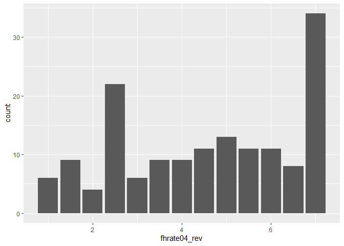
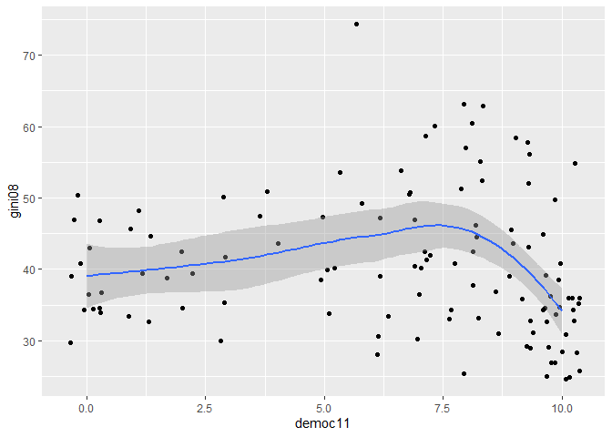
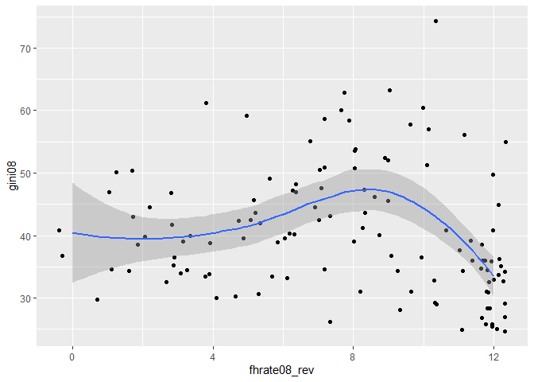
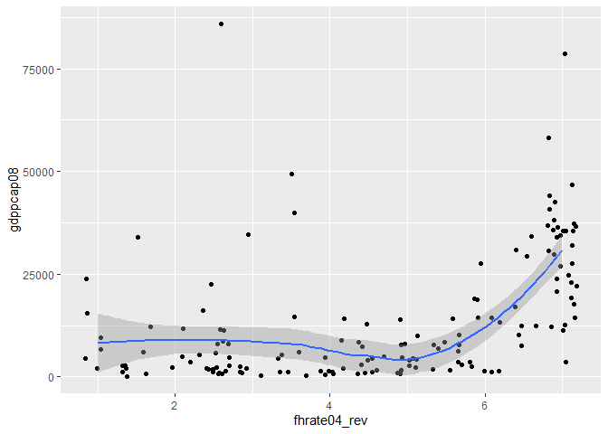

Exercicio 5
================
Ulisses Matheus

### Carregue o banco de dados `world` que está no pacote `poliscidata`.

``` r
library(poliscidata)
```

    ## Warning: package 'poliscidata' was built under R version 4.0.2

``` r
banco <- world
```

### Existem diversas medidas de democracia para os países: `dem_score14`, `democ11`, `fhrate04_rev`, `fhrate08_rev`, `polity`. Descreva-as graficamente e diga quais são as diferenças entre tais medidas.

Utilizei gráficos de barras e historiograma (dem\_score14) nas variáveis
para representar o número de países com avaliações correspondetes. As
variáveis possuem, inclusive, resultados próximos, é possível oservar,
por exemplo, uma alta concentração de países no “topo” de alguns
rankings (polity, fhrate08\_rev e fhrate08\_rev). No entanto, a variável
democ11 apresenta uma alta concetração de países nos extremos das
avaliações, enquanto a variável dem\_score14 distribui valores de forma
mais dispersa, não havendo uma grande conentração em torno de uma
determinada avaliação

A principal diferença entre cada variável, é a quantificação da
avaliação. A variável “polity”, por exemplo, utiliza numerais
negativos em seu ranking, enquanto todas as outras usam apenas
positivos. Já a “dem\_score14” detalha sua avalição até a casa dos
centésimos (o que permitiu uma melhor adaptação do historiograma como
modelo gráfico), e também aparenta ser mais criterioso em sua avaliação,
tendo em vista, como já foi dito, uma maior dispersão das avaliações.

``` r
library(tidyverse)
```

    ## -- Attaching packages ------------------------------------------------------------- tidyverse 1.3.0 --

    ## v ggplot2 3.3.2     v purrr   0.3.4
    ## v tibble  3.0.1     v dplyr   1.0.0
    ## v tidyr   1.1.0     v stringr 1.4.0
    ## v readr   1.3.1     v forcats 0.5.0

    ## -- Conflicts ---------------------------------------------------------------- tidyverse_conflicts() --
    ## x dplyr::filter() masks stats::filter()
    ## x dplyr::lag()    masks stats::lag()

``` r
ggplot(banco, aes(dem_score14)) + geom_histogram(binwidth = 0.3)
```

<!-- -->

``` r
ggplot(banco, aes(democ11)) + geom_bar()
```

    ## Warning: Removed 23 rows containing non-finite values (stat_count).

<!-- -->

``` r
ggplot(banco, aes(fhrate04_rev)) + geom_bar()
```

    ## Warning: Removed 14 rows containing non-finite values (stat_count).

<!-- -->

``` r
ggplot(banco, aes(fhrate08_rev)) + geom_bar()
```

    ## Warning: Removed 15 rows containing non-finite values (stat_count).

<!-- -->

``` r
ggplot(banco, aes(polity)) + geom_bar()
```

    ## Warning: Removed 23 rows containing non-finite values (stat_count).

<!-- -->

### Avalie a relação entre tais medidas de democracia e desigualdade, utilizando a variável `gini08`. Descreva graficamente esta variável, a relação entre as duas variáveis, meça a correlação entre elas e faça regressões lineares (interpretando em profundidade os resultados dos coeficientes e medidas de desempenho dos modelos). Enfatize as semelhanças e diferenças entre os resultados. Quais são suas conclusões?

## dem\_score14 x gini08

``` r
regressaoscore14 <- lm(dem_score14~gini08, data = banco)
summary(regressaoscore14)
```

    ## 
    ## Call:
    ## lm(formula = dem_score14 ~ gini08, data = banco)
    ## 
    ## Residuals:
    ##     Min      1Q  Median      3Q     Max 
    ## -4.0728 -1.7583  0.3513  1.6742  3.3600 
    ## 
    ## Coefficients:
    ##             Estimate Std. Error t value Pr(>|t|)    
    ## (Intercept)  7.71756    0.75639  10.203   <2e-16 ***
    ## gini08      -0.04448    0.01807  -2.462   0.0152 *  
    ## ---
    ## Signif. codes:  0 '***' 0.001 '**' 0.01 '*' 0.05 '.' 0.1 ' ' 1
    ## 
    ## Residual standard error: 2.003 on 120 degrees of freedom
    ##   (45 observations deleted due to missingness)
    ## Multiple R-squared:  0.04809,    Adjusted R-squared:  0.04015 
    ## F-statistic: 6.062 on 1 and 120 DF,  p-value: 0.01523

``` r
confint(regressaoscore14, level = 0.95)
```

    ##                   2.5 %      97.5 %
    ## (Intercept)  6.21996464  9.21514871
    ## gini08      -0.08024753 -0.00871069

``` r
ggplot(banco, aes(dem_score14,gini08)) + geom_jitter() + geom_smooth()
```

    ## `geom_smooth()` using method = 'loess' and formula 'y ~ x'

    ## Warning: Removed 45 rows containing non-finite values (stat_smooth).

    ## Warning: Removed 45 rows containing missing values (geom_point).

<!-- -->

## democ11 x gini08

``` r
regressaodemoc11 <- lm(democ11~gini08, data = banco)
summary(regressaodemoc11)
```

    ## 
    ## Call:
    ## lm(formula = democ11 ~ gini08, data = banco)
    ## 
    ## Residuals:
    ##    Min     1Q Median     3Q    Max 
    ## -6.796 -2.213  1.302  3.049  3.958 
    ## 
    ## Coefficients:
    ##             Estimate Std. Error t value Pr(>|t|)    
    ## (Intercept)  7.68568    1.38306   5.557 1.85e-07 ***
    ## gini08      -0.02994    0.03311  -0.904    0.368    
    ## ---
    ## Signif. codes:  0 '***' 0.001 '**' 0.01 '*' 0.05 '.' 0.1 ' ' 1
    ## 
    ## Residual standard error: 3.47 on 113 degrees of freedom
    ##   (52 observations deleted due to missingness)
    ## Multiple R-squared:  0.007186,   Adjusted R-squared:  -0.0016 
    ## F-statistic: 0.8179 on 1 and 113 DF,  p-value: 0.3677

``` r
confint(regressaodemoc11, level = 0.95)
```

    ##                   2.5 %      97.5 %
    ## (Intercept)  4.94558726 10.42576632
    ## gini08      -0.09552709  0.03564705

``` r
ggplot(banco, aes(democ11,gini08)) + geom_jitter() + geom_smooth()
```

    ## `geom_smooth()` using method = 'loess' and formula 'y ~ x'

    ## Warning: Removed 52 rows containing non-finite values (stat_smooth).

    ## Warning: Removed 52 rows containing missing values (geom_point).

<!-- -->

## fhrate04\_rev x gini08

``` r
regressaofhrate04 <- lm(fhrate04_rev ~ gini08, data = banco)
summary(regressaofhrate04)
```

    ## 
    ## Call:
    ## lm(formula = fhrate04_rev ~ gini08, data = banco)
    ## 
    ## Residuals:
    ##     Min      1Q  Median      3Q     Max 
    ## -3.8312 -1.3896  0.4312  1.6729  2.6199 
    ## 
    ## Coefficients:
    ##             Estimate Std. Error t value Pr(>|t|)    
    ## (Intercept)  6.13654    0.67419   9.102 2.35e-15 ***
    ## gini08      -0.03199    0.01610  -1.987   0.0492 *  
    ## ---
    ## Signif. codes:  0 '***' 0.001 '**' 0.01 '*' 0.05 '.' 0.1 ' ' 1
    ## 
    ## Residual standard error: 1.786 on 120 degrees of freedom
    ##   (45 observations deleted due to missingness)
    ## Multiple R-squared:  0.03185,    Adjusted R-squared:  0.02378 
    ## F-statistic: 3.948 on 1 and 120 DF,  p-value: 0.04921

``` r
confint(regressaofhrate04, level = 0.95)
```

    ##                   2.5 %       97.5 %
    ## (Intercept)  4.80168759  7.471400187
    ## gini08      -0.06387567 -0.000112373

``` r
ggplot(banco, aes(fhrate04_rev, gini08)) + geom_jitter() + geom_smooth()
```

    ## `geom_smooth()` using method = 'loess' and formula 'y ~ x'

    ## Warning: Removed 45 rows containing non-finite values (stat_smooth).

    ## Warning: Removed 45 rows containing missing values (geom_point).

<!-- -->

## fhrate08\_rev x gini08

``` r
regressaofhrate08 <- lm(fhrate08_rev ~ gini08, data = banco)
summary(regressaofhrate08)
```

    ## 
    ## Call:
    ## lm(formula = fhrate08_rev ~ gini08, data = banco)
    ## 
    ## Residuals:
    ##     Min      1Q  Median      3Q     Max 
    ## -7.9157 -2.5971  0.6712  3.4091  5.0961 
    ## 
    ## Coefficients:
    ##             Estimate Std. Error t value Pr(>|t|)    
    ## (Intercept)  9.97288    1.34188   7.432 1.79e-11 ***
    ## gini08      -0.05590    0.03207  -1.743   0.0839 .  
    ## ---
    ## Signif. codes:  0 '***' 0.001 '**' 0.01 '*' 0.05 '.' 0.1 ' ' 1
    ## 
    ## Residual standard error: 3.554 on 119 degrees of freedom
    ##   (46 observations deleted due to missingness)
    ## Multiple R-squared:  0.0249, Adjusted R-squared:  0.01671 
    ## F-statistic: 3.039 on 1 and 119 DF,  p-value: 0.08387

``` r
confint(regressaofhrate08, level = 0.95)
```

    ##                  2.5 %       97.5 %
    ## (Intercept)  7.3158302 12.629937649
    ## gini08      -0.1193971  0.007595494

``` r
ggplot(banco, aes(fhrate08_rev, gini08)) + geom_jitter() + geom_smooth()
```

    ## `geom_smooth()` using method = 'loess' and formula 'y ~ x'

    ## Warning: Removed 46 rows containing non-finite values (stat_smooth).

    ## Warning: Removed 46 rows containing missing values (geom_point).

<!-- -->

## polity x gini08

``` r
regressaopolity <- lm(polity ~ gini08, data = banco)
summary(regressaopolity)
```

    ## 
    ## Call:
    ## lm(formula = polity ~ gini08, data = banco)
    ## 
    ## Residuals:
    ##     Min      1Q  Median      3Q     Max 
    ## -14.374  -1.300   2.364   4.087   5.040 
    ## 
    ## Coefficients:
    ##             Estimate Std. Error t value Pr(>|t|)   
    ## (Intercept)  6.21813    2.20594   2.819  0.00569 **
    ## gini08      -0.02292    0.05280  -0.434  0.66499   
    ## ---
    ## Signif. codes:  0 '***' 0.001 '**' 0.01 '*' 0.05 '.' 0.1 ' ' 1
    ## 
    ## Residual standard error: 5.535 on 113 degrees of freedom
    ##   (52 observations deleted due to missingness)
    ## Multiple R-squared:  0.001665,   Adjusted R-squared:  -0.007169 
    ## F-statistic: 0.1885 on 1 and 113 DF,  p-value: 0.665

``` r
confint(regressaopolity, level = 0.95)
```

    ##                  2.5 %      97.5 %
    ## (Intercept)  1.8477696 10.58848167
    ## gini08      -0.1275342  0.08168441

``` r
ggplot(banco, aes(polity, gini08)) + geom_jitter() + geom_smooth()
```

    ## `geom_smooth()` using method = 'loess' and formula 'y ~ x'

    ## Warning: Removed 52 rows containing non-finite values (stat_smooth).

    ## Warning: Removed 52 rows containing missing values (geom_point).

<!-- -->

Apesar da grande similaridade entre os gráficos (que descrevem uma lenta
e pequena queda inicial, seguida por uma ascensão da linha quase tão
tímida quanto a queda anterior e, por fim, mais uma queda, desta vez
bastante agressiva) alguns dados não apresentam um p-valor confiável,
nem passam no teste T, como é o caso dos dados obtidos a partir da
relação de gini08 com *democ11* e *polity*.

Se observarmos o erro padrão e o intervalo de confiança das correlações,
em conjunto com o que já foi exposto acima, podemos afirmar que as
regressões lineares representadas nos gráficos com maior precisão foram
as das correlações de *gini08* com *dem\_score14* e *fhrate04\_rev*. O
intervalo de confiança obtido em ambos foi satisfatório, o erro padrão e
o p-valor foram baixos, o que possibilita a utilização dos dados na
avaliação de uma hipótese.

A consistente repetição gráfica, no entanto, pode indicar que, mesmo com
esse p-valor baixo, tais dados podem ser levados em conta de alguma
forma. Sendo assim pode-se afirmar que há uma correlação forte entre
baixa desigualdade e democracia quando falamos dos países mais
democráticos.

Entretanto, entre aquele mais autoritários e as “democracias
imperfeitas” (termo utilizado pela The Economist para caracterizar
regimes com deficiências democráticas), há pouca variação entre
desigualdade e democracia. Na verdade, é possível considerar covariação
positiva nesse sentido, ou seja, a desigualdade só é reduzida em
democracias plenas, fora desse grupo há um crescimento no indíce de Gini
correlacionado à melhores avaliações nos rankings democráticos.

### Avalie a relação entre tais medidas de democracia e crescimento econômico, utilizando a variável `gdppcap08`. Descreva graficamente esta variável, a relação entre as duas variáveis, meça a correlação entre elas e faça regressões lineares (interpretando em profundidade os resultados dos coeficientes e medidas de desempenho dos modelos). Enfatize as semelhanças e diferenças entre os resultados. Quais são suas conclusões?

## dem\_score14 x gdppcap08

``` r
regressaocap1 <- lm(dem_score14 ~ gdppcap08, data = banco)
summary(regressaocap1)
```

    ## 
    ## Call:
    ## lm(formula = dem_score14 ~ gdppcap08, data = banco)
    ## 
    ## Residuals:
    ##     Min      1Q  Median      3Q     Max 
    ## -7.5428 -1.3420  0.6982  1.2843  3.0329 
    ## 
    ## Coefficients:
    ##              Estimate Std. Error t value Pr(>|t|)    
    ## (Intercept) 4.678e+00  2.017e-01  23.197  < 2e-16 ***
    ## gdppcap08   7.040e-05  9.817e-06   7.171 3.16e-11 ***
    ## ---
    ## Signif. codes:  0 '***' 0.001 '**' 0.01 '*' 0.05 '.' 0.1 ' ' 1
    ## 
    ## Residual standard error: 1.864 on 150 degrees of freedom
    ##   (15 observations deleted due to missingness)
    ## Multiple R-squared:  0.2553, Adjusted R-squared:  0.2504 
    ## F-statistic: 51.43 on 1 and 150 DF,  p-value: 3.159e-11

``` r
confint(regressaocap1, level = 0.95)
```

    ##                    2.5 %       97.5 %
    ## (Intercept) 4.279401e+00 5.076314e+00
    ## gdppcap08   5.100126e-05 8.979475e-05

``` r
ggplot(banco, aes(dem_score14, gdppcap08)) + geom_jitter() + geom_smooth()
```

    ## `geom_smooth()` using method = 'loess' and formula 'y ~ x'

    ## Warning: Removed 15 rows containing non-finite values (stat_smooth).

    ## Warning: Removed 15 rows containing missing values (geom_point).

<!-- -->

## democ11 x gdppcap08

``` r
regressaocap2 <- lm(democ11 ~ gdppcap08, data = banco)
summary(regressaocap2)
```

    ## 
    ## Call:
    ## lm(formula = democ11 ~ gdppcap08, data = banco)
    ## 
    ## Residuals:
    ##     Min      1Q  Median      3Q     Max 
    ## -11.258  -3.030   1.723   2.783   4.803 
    ## 
    ## Coefficients:
    ##              Estimate Std. Error t value Pr(>|t|)    
    ## (Intercept) 4.939e+00  4.026e-01  12.270  < 2e-16 ***
    ## gdppcap08   7.359e-05  2.042e-05   3.604 0.000435 ***
    ## ---
    ## Signif. codes:  0 '***' 0.001 '**' 0.01 '*' 0.05 '.' 0.1 ' ' 1
    ## 
    ## Residual standard error: 3.57 on 140 degrees of freedom
    ##   (25 observations deleted due to missingness)
    ## Multiple R-squared:  0.08489,    Adjusted R-squared:  0.07835 
    ## F-statistic: 12.99 on 1 and 140 DF,  p-value: 0.000435

``` r
confint(regressaocap2, level = 0.95)
```

    ##                    2.5 %       97.5 %
    ## (Intercept) 4.143600e+00 5.7353437948
    ## gdppcap08   3.321747e-05 0.0001139613

``` r
ggplot(banco, aes(democ11, gdppcap08)) + geom_jitter() + geom_smooth()
```

    ## `geom_smooth()` using method = 'loess' and formula 'y ~ x'

    ## Warning: Removed 25 rows containing non-finite values (stat_smooth).

    ## Warning: Removed 25 rows containing missing values (geom_point).

<!-- -->

## fhrate04\_rev x gdppcap08

``` r
regressaocap3 <- lm(fhrate04_rev ~ gdppcap08, data = banco)
summary(regressaocap3)
```

    ## 
    ## Call:
    ## lm(formula = fhrate04_rev ~ gdppcap08, data = banco)
    ## 
    ## Residuals:
    ##     Min      1Q  Median      3Q     Max 
    ## -6.0897 -1.4154  0.5914  1.2481  2.9773 
    ## 
    ## Coefficients:
    ##              Estimate Std. Error t value Pr(>|t|)    
    ## (Intercept) 3.828e+00  1.894e-01  20.210  < 2e-16 ***
    ## gdppcap08   5.545e-05  9.222e-06   6.013 1.33e-08 ***
    ## ---
    ## Signif. codes:  0 '***' 0.001 '**' 0.01 '*' 0.05 '.' 0.1 ' ' 1
    ## 
    ## Residual standard error: 1.751 on 150 degrees of freedom
    ##   (15 observations deleted due to missingness)
    ## Multiple R-squared:  0.1942, Adjusted R-squared:  0.1888 
    ## F-statistic: 36.16 on 1 and 150 DF,  p-value: 1.331e-08

``` r
confint(regressaocap3, level = 0.95)
```

    ##                    2.5 %       97.5 %
    ## (Intercept) 3.454144e+00 4.202754e+00
    ## gdppcap08   3.722775e-05 7.366986e-05

``` r
ggplot(banco, aes(fhrate04_rev, gdppcap08)) + geom_jitter() + geom_smooth()
```

    ## `geom_smooth()` using method = 'loess' and formula 'y ~ x'

    ## Warning: Removed 15 rows containing non-finite values (stat_smooth).

    ## Warning: Removed 15 rows containing missing values (geom_point).

<!-- -->

## fhrate08\_rev x gdppcap08

``` r
regressaocap4 <- lm(fhrate08_rev ~ gdppcap08, data = banco)
summary(regressaocap4)
```

    ## 
    ## Call:
    ## lm(formula = fhrate08_rev ~ gdppcap08, data = banco)
    ## 
    ## Residuals:
    ##     Min      1Q  Median      3Q     Max 
    ## -12.124  -2.345   1.164   2.510   5.918 
    ## 
    ## Coefficients:
    ##              Estimate Std. Error t value Pr(>|t|)    
    ## (Intercept) 5.698e+00  3.739e-01  15.237  < 2e-16 ***
    ## gdppcap08   1.098e-04  1.814e-05   6.051 1.11e-08 ***
    ## ---
    ## Signif. codes:  0 '***' 0.001 '**' 0.01 '*' 0.05 '.' 0.1 ' ' 1
    ## 
    ## Residual standard error: 3.438 on 149 degrees of freedom
    ##   (16 observations deleted due to missingness)
    ## Multiple R-squared:  0.1973, Adjusted R-squared:  0.1919 
    ## F-statistic: 36.61 on 1 and 149 DF,  p-value: 1.115e-08

``` r
confint(regressaocap4, level = 0.95)
```

    ##                    2.5 %       97.5 %
    ## (Intercept) 4.958685e+00 6.4364793856
    ## gdppcap08   7.393055e-05 0.0001456336

``` r
ggplot(banco, aes(fhrate08_rev, gdppcap08)) + geom_jitter() + geom_smooth()
```

    ## `geom_smooth()` using method = 'loess' and formula 'y ~ x'

    ## Warning: Removed 16 rows containing non-finite values (stat_smooth).

    ## Warning: Removed 16 rows containing missing values (geom_point).

<!-- -->

## polity \~ gdppcap08

``` r
regressaocap5 <- lm(polity ~ gdppcap08, data = banco)
summary(regressaocap5)
```

    ## 
    ## Call:
    ## lm(formula = polity ~ gdppcap08, data = banco)
    ## 
    ## Residuals:
    ##     Min      1Q  Median      3Q     Max 
    ## -19.426  -4.207   2.847   4.332   6.378 
    ## 
    ## Coefficients:
    ##              Estimate Std. Error t value Pr(>|t|)    
    ## (Intercept) 3.375e+00  6.833e-01   4.940  2.2e-06 ***
    ## gdppcap08   7.047e-05  3.466e-05   2.033   0.0439 *  
    ## ---
    ## Signif. codes:  0 '***' 0.001 '**' 0.01 '*' 0.05 '.' 0.1 ' ' 1
    ## 
    ## Residual standard error: 6.059 on 140 degrees of freedom
    ##   (25 observations deleted due to missingness)
    ## Multiple R-squared:  0.02868,    Adjusted R-squared:  0.02174 
    ## F-statistic: 4.134 on 1 and 140 DF,  p-value: 0.04392

``` r
confint(regressaocap5, level = 0.95)
```

    ##                    2.5 %       97.5 %
    ## (Intercept) 2.024106e+00 4.7257627510
    ## gdppcap08   1.945306e-06 0.0001389914

``` r
ggplot(banco, aes(polity, gdppcap08)) + geom_jitter() + geom_smooth()
```

    ## `geom_smooth()` using method = 'loess' and formula 'y ~ x'

    ## Warning: Removed 25 rows containing non-finite values (stat_smooth).

    ## Warning: Removed 25 rows containing missing values (geom_point).

<!-- -->

Da mesma forma que no teste anterior, a comparação de algumas variáveis
obtiveram um p-valor bastante alto e não passaram no teste T
(*democ11*). No entanto, a maioria dos gráficos passam no teste T e
apresentam um p-valor baixo, além de representar graficamente a mesma
tendência: uma estabilidade inicial seguida por um rápido crescimento na
renda per capita entre os países mais democráticos.

Entretanto, dois graficos (*democ11* e *polity*) não seguiram exatamente
o mesmo padrão, tendo apontado uma renda per capita maior entre os
países menos democráticos do que os com uma avaliação “média”
(democracias imperfeitas). A regressão linear nesses gráficos apresentou
uma lenta queda inicial na renda per capita no decorrer do crescimento
da avaliação democrática, essa tendência se inverte a partir do ultímo
terço de avaliação.

Entretanto, com base na regressão realizada, restou claro que a
correlação *democ11* e *gdppcap08* não seria indicada para o teste de
uma hipótese. As outras regressões realizadas apontaram para resultados
mais satisfatórios, principalemnte as regressões feitas a partir de
*fhrate04\_rev* e *dem\_socore14* com a *gdppcap08*, que obtiveram um
intervalo de confiança pequeno, e um p-valor de acordo com o que
geralmente é exigido pela doutrina.

A partir dos gráficos, no entanto, é possível observar que a correlação
entre renda e democracia só se torna mais clara nas democracias mais
desenvolvidas. Entre os países mais autoritários e as democracias
imperfeitas não há uma correlação forte entre o critério renda e
democracia. Na verdade, tal qual no cenário anterior, é possível
observar uma leve relaçao negativa entre riqueza e democracia até certo
ponto, quando a curva ascendente surge na regressão linear.

### Avalie a relação entre tais medidas de democracia e produção de petróleo, utilizando a variável `oil`. Descreva graficamente esta variável, a relação entre as duas variáveis, meça a correlação entre elas e faça regressões lineares (interpretando em profundidade os resultados dos coeficientes e medidas de desempenho dos modelos). Enfatize as semelhanças e diferenças entre os resultados. Quais são suas conclusões?

## oil x dem\_score14

``` r
regressaooil1 <- lm(oil ~ dem_score14, data = banco)
summary(regressaooil1)
```

    ## 
    ## Call:
    ## lm(formula = oil ~ dem_score14, data = banco)
    ## 
    ## Residuals:
    ##     Min      1Q  Median      3Q     Max 
    ## -896592 -550473 -409266 -206660 9421262 
    ## 
    ## Coefficients:
    ##             Estimate Std. Error t value Pr(>|t|)   
    ## (Intercept)   989268     313084   3.160  0.00188 **
    ## dem_score14   -85702      52438  -1.634  0.10411   
    ## ---
    ## Signif. codes:  0 '***' 0.001 '**' 0.01 '*' 0.05 '.' 0.1 ' ' 1
    ## 
    ## Residual standard error: 1469000 on 163 degrees of freedom
    ##   (2 observations deleted due to missingness)
    ## Multiple R-squared:  0.01612,    Adjusted R-squared:  0.01009 
    ## F-statistic: 2.671 on 1 and 163 DF,  p-value: 0.1041

``` r
confint(regressaooil1, level = 0.95)
```

    ##                 2.5 %     97.5 %
    ## (Intercept)  371045.9 1607490.91
    ## dem_score14 -189247.6   17843.23

``` r
ggplot(banco, aes(oil, dem_score14)) + geom_jitter() + geom_smooth()
```

    ## `geom_smooth()` using method = 'loess' and formula 'y ~ x'

    ## Warning: Removed 2 rows containing non-finite values (stat_smooth).

    ## Warning: Removed 2 rows containing missing values (geom_point).

<!-- -->

## oil x democ11

``` r
regressaooil2 <- lm(oil ~ democ11 , data = banco)
summary(regressaooil2)
```

    ## 
    ## Call:
    ## lm(formula = oil ~ democ11, data = banco)
    ## 
    ## Residuals:
    ##     Min      1Q  Median      3Q     Max 
    ## -906830 -547718 -368163 -241953 9512430 
    ## 
    ## Coefficients:
    ##             Estimate Std. Error t value Pr(>|t|)    
    ## (Intercept)   906830     244095   3.715 0.000291 ***
    ## democ11       -59852      34839  -1.718 0.087980 .  
    ## ---
    ## Signif. codes:  0 '***' 0.001 '**' 0.01 '*' 0.05 '.' 0.1 ' ' 1
    ## 
    ## Residual standard error: 1546000 on 142 degrees of freedom
    ##   (23 observations deleted due to missingness)
    ## Multiple R-squared:  0.02036,    Adjusted R-squared:  0.01346 
    ## F-statistic: 2.951 on 1 and 142 DF,  p-value: 0.08798

``` r
confint(regressaooil2, level = 0.95)
```

    ##                 2.5 %      97.5 %
    ## (Intercept)  424301.1 1389359.021
    ## democ11     -128721.2    9017.363

``` r
ggplot(banco, aes(oil, democ11)) + geom_jitter() + geom_smooth()
```

    ## `geom_smooth()` using method = 'loess' and formula 'y ~ x'

    ## Warning: Removed 23 rows containing non-finite values (stat_smooth).

    ## Warning: Removed 23 rows containing missing values (geom_point).

<!-- -->

## oil x fhrate04\_rev

``` r
regressaooil3 <- lm(oil ~ fhrate04_rev, data = banco)
summary(regressaooil3)
```

    ## 
    ## Call:
    ## lm(formula = oil ~ fhrate04_rev, data = banco)
    ## 
    ## Residuals:
    ##     Min      1Q  Median      3Q     Max 
    ## -918120 -603261 -361128 -181882 9335139 
    ## 
    ## Coefficients:
    ##              Estimate Std. Error t value Pr(>|t|)    
    ## (Intercept)   1087527     312415   3.481 0.000654 ***
    ## fhrate04_rev  -121066      62913  -1.924 0.056203 .  
    ## ---
    ## Signif. codes:  0 '***' 0.001 '**' 0.01 '*' 0.05 '.' 0.1 ' ' 1
    ## 
    ## Residual standard error: 1509000 on 150 degrees of freedom
    ##   (15 observations deleted due to missingness)
    ## Multiple R-squared:  0.02409,    Adjusted R-squared:  0.01759 
    ## F-statistic: 3.703 on 1 and 150 DF,  p-value: 0.0562

``` r
confint(regressaooil3, level = 0.95)
```

    ##                  2.5 %      97.5 %
    ## (Intercept)   470225.4 1704828.289
    ## fhrate04_rev -245376.0    3243.246

``` r
ggplot(banco, aes(oil,fhrate04_rev)) + geom_jitter() + geom_smooth()
```

    ## `geom_smooth()` using method = 'loess' and formula 'y ~ x'

    ## Warning: Removed 15 rows containing non-finite values (stat_smooth).

    ## Warning: Removed 15 rows containing missing values (geom_point).

<!-- -->

## oil x fhrate08\_rev

``` r
regressaooil4 <- lm( oil ~ fhrate08_rev, data = banco)
summary(regressaooil4)
```

    ## 
    ## Call:
    ## lm(formula = oil ~ fhrate08_rev, data = banco)
    ## 
    ## Residuals:
    ##     Min      1Q  Median      3Q     Max 
    ## -910650 -608377 -366559 -197000 9330259 
    ## 
    ## Coefficients:
    ##              Estimate Std. Error t value Pr(>|t|)    
    ## (Intercept)    971104     261709   3.711 0.000291 ***
    ## fhrate08_rev   -60455      32193  -1.878 0.062354 .  
    ## ---
    ## Signif. codes:  0 '***' 0.001 '**' 0.01 '*' 0.05 '.' 0.1 ' ' 1
    ## 
    ## Residual standard error: 1514000 on 149 degrees of freedom
    ##   (16 observations deleted due to missingness)
    ## Multiple R-squared:  0.02312,    Adjusted R-squared:  0.01656 
    ## F-statistic: 3.526 on 1 and 149 DF,  p-value: 0.06235

``` r
confint(regressaooil4, level = 0.95)
```

    ##                  2.5 %      97.5 %
    ## (Intercept)   453963.5 1488244.714
    ## fhrate08_rev -124068.6    3159.657

``` r
ggplot(banco, aes(oil,fhrate08_rev)) + geom_jitter() + geom_smooth()
```

    ## `geom_smooth()` using method = 'loess' and formula 'y ~ x'

    ## Warning: Removed 16 rows containing non-finite values (stat_smooth).

    ## Warning: Removed 16 rows containing missing values (geom_point).

<!-- -->

## oil x polity

``` r
regressaooil5 <- lm( oil~polity, data = banco)
summary(regressaooil5)
```

    ## 
    ## Call:
    ## lm(formula = oil ~ polity, data = banco)
    ## 
    ## Residuals:
    ##      Min       1Q   Median       3Q      Max 
    ## -1167777  -516818  -363383  -226603  9552692 
    ## 
    ## Coefficients:
    ##             Estimate Std. Error t value Pr(>|t|)    
    ## (Intercept)   752068     157494   4.775 4.42e-06 ***
    ## polity        -46190      21044  -2.195   0.0298 *  
    ## ---
    ## Signif. codes:  0 '***' 0.001 '**' 0.01 '*' 0.05 '.' 0.1 ' ' 1
    ## 
    ## Residual standard error: 1536000 on 142 degrees of freedom
    ##   (23 observations deleted due to missingness)
    ## Multiple R-squared:  0.03282,    Adjusted R-squared:  0.026 
    ## F-statistic: 4.818 on 1 and 142 DF,  p-value: 0.02979

``` r
confint(regressaooil5, level = 0.95)
```

    ##                2.5 %      97.5 %
    ## (Intercept) 440730.9 1063404.072
    ## polity      -87788.9   -4591.016

``` r
ggplot(banco, aes(oil, polity)) + geom_jitter() + geom_smooth()
```

    ## `geom_smooth()` using method = 'loess' and formula 'y ~ x'

    ## Warning: Removed 23 rows containing non-finite values (stat_smooth).

    ## Warning: Removed 23 rows containing missing values (geom_point).

<!-- -->

Apenas uma correlação apresentou um p-valor abaixo de 0.05: *oil x
polity*. Apesar de nenhuma das correlações apresentar um p-valor muito
alto, acima de 0.11, todas elas obtiveram um erro padrão maior que a
regressão linear acima citada, como também tiveram um resultado pior no
teste T.

O principal problema dessa análise, contudo, é o grande número de países
que não possuem reservas naturais de petróleo, o que gera uma grande
dispersão entre estes e as maiores potências petrlíferas do mundo e
difculta a construção gráfica de uma regressão linear.

É possível, contudo, a partir da regressão linear obtida entre *oil x
polity*, observar uma leve covariação negatva entre petróleo e avaliação
democrática, principalmente entre os países que não tem reservas de
petróle e os que possuem algumas poucas. Isso pode condizer com uma
hipótese que afirme que desenvolver uma democracia em um país com mais
reservas de petróleo aparenta ser mais difícil que em países sem esse
produto mineral.

No entanto, é possível observar que essa tendência se desfaz entre as
maiores potências petroleiras do mundo, havendo uma pequena variação em
forma de “u” na maior parte do gráfico.

### Avalie a relação entre crescimento econômico e produção de petróleo. Descreva a relação entre as duas variáveis, meça a correlação entre elas e faça regressões lineares (interpretando em profundidade os resultados dos coeficientes e medidas de desempenho dos modelos). Enfatize as semelhanças e diferenças entre os resultados. Quais são suas conclusões?

``` r
regressaooilcap <- lm( oil~gdppcap08, data = banco)
summary(regressaooilcap)
```

    ## 
    ## Call:
    ## lm(formula = oil ~ gdppcap08, data = banco)
    ## 
    ## Residuals:
    ##      Min       1Q   Median       3Q      Max 
    ## -1725413  -514718  -323620  -280279  9536215 
    ## 
    ## Coefficients:
    ##              Estimate Std. Error t value Pr(>|t|)  
    ## (Intercept) 2.888e+05  1.633e+05   1.768   0.0791 .
    ## gdppcap08   1.828e+01  7.929e+00   2.305   0.0225 *
    ## ---
    ## Signif. codes:  0 '***' 0.001 '**' 0.01 '*' 0.05 '.' 0.1 ' ' 1
    ## 
    ## Residual standard error: 1505000 on 149 degrees of freedom
    ##   (16 observations deleted due to missingness)
    ## Multiple R-squared:  0.03443,    Adjusted R-squared:  0.02795 
    ## F-statistic: 5.313 on 1 and 149 DF,  p-value: 0.02254

``` r
confint(regressaooilcap, level = 0.95)
```

    ##                     2.5 %       97.5 %
    ## (Intercept) -33956.978903 611558.75844
    ## gdppcap08        2.609149     33.94632

``` r
ggplot(banco, aes(oil,gdppcap08)) + geom_point() + geom_smooth()
```

    ## `geom_smooth()` using method = 'loess' and formula 'y ~ x'

    ## Warning: Removed 16 rows containing non-finite values (stat_smooth).

    ## Warning: Removed 16 rows containing missing values (geom_point).

<!-- -->

A correlação possui um p-valor relativamente baixo (0.022), e passa no
teste T (2.3), apesar de apresentar um grande intervalo de confiança, o
que diminui a funcionalidade da regressão. A partir da construção do
gráfico e da regressão linear é possível observar uma ligeira
correlação positiva entre os países que possuem uma pequena reserva de
petróleo e a renda per capita. No entanto, essa tendência não se mantêm,
após certa ascensão a linha acaba por permanecer estável, não indicando
uma correlação forte entre renda per capta e reservas de petróleo. Isso
pode ser exemplificado da seguinte forma: países ricos não possuem
necessariamente reservas de petróleo (Luxemburgo, Suíça e Japão), como
também países com grandes reservas podem apresentar uma renda per capta
baixa (Nigéria e Venezuela)

### A partir das suas conclusões sobre a relação entre democracia, economia e produção de petróleo, quais considerações são possíveis fazer sobre a relação CAUSAL entre estas variáveis? Lembre dos 4 “hurdles” do livro *Fundamentals of Political Science Research*

A ideia de que democracia promove desenvolvimento, ou que
desenvolvimento promove democracia é até hoje muito debatida. Przeworski
defende que uma economia com crescimento estável é um fator importante
para a continuidade democratica, no entanto, a relação do
desenvolvimento econômico com a estabilidade promovida por uma
democracia segura também é levantada por alguns teóricos.

Dessa forma, afirmar que o nível democrático (x) gera uma maior renda
per capita (y) é tão viável quanto afirmar que y causa x. O que se sabe,
contudo, é que democracia e renda são covariantes a princípio, mesmo que
não saibamos o que gera o quê.

Já no que se refere à relação entre democracia e desigualdade é possível
observar uma relação negativa a partir de certa qualidade democrática,
ou seja, quanto melhor o nível democrático menos desigual é o país. Essa
tendência, contudo, só é observada no último quartil das avaliações
democráticas, o que pode indicar que o último estágio de uma democracia
plena é a diminuição da desigualdade social.

Esse não é um problema para a terceira e quarta covariação. Podemos
descartar que democracia gera fontes de petróleo, já que este é um bem
natural distribuido a partir de critérios geográficos razoavelmente
aleatórios.

No que se refere ao “ouro negro” temos uma aparente contradição. Esse
material é um dos bens primários mais valorizados do mundo, mas sua
incidência em um país não significa estabilidade democrática e nem mesmo
um acrescimo considerável na renda per capita.

É possível observar a partir dos gráficos que a variável petróleo tende
a ser mais encontrada em países pouco democráticos e gera pouca, ou
nenhuma, influência na riqueza de um país. Duas teorias causais podem
justificar essas covariações aparentemente contraditórias.

A primeira é que, como todo bem primário, o petróleo pode ser exportado
em estado bruto e gerar pouca riqueza para o país produtor, seu refino e
distribuição é a verdadeira fonte de riqueza, isso faz com que grandes
produtores enriqueçam menos que grandes distribuidores de petróleo.

A segunda é que, como todo bem natural extremamente valioso, o petróleo
atraiu a cobiça de potências mundiais, principalmente no último século.
Isso acabou por promover uma série de conflitos militares e econômicos
em diversos países produtores, vide as guerras do golfo e a crise mundia
do petróleo. O recrudescimento dos regimes políticos nas regiões
produtoras acabou sendo uma consequência direta desses conflitos e
ambições. Pode-se dizer, portanto, a existência de petróleo (x) em um
país aumenta a possibilidade de instabilidade política (z) e,
consequentemente, a diminuição de índices democráticos (y).
