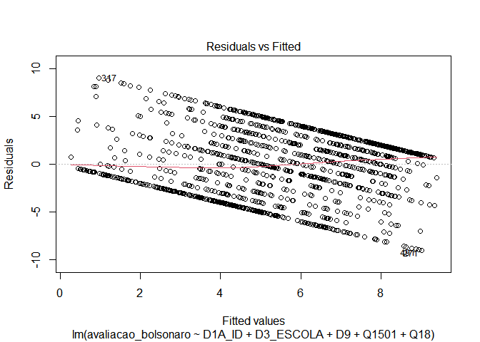

Exercicio 7
================
Ulisses Matheus

### No exercício anterior foram feitos alguns modelos bivariados. Agora faça uma regressão multivariada mostrando como a nota atribuída a Jair Bolsonaro (variável Q1607) pode ser explicada pelas variáveis idade (D1A\_ID), educação (D3\_ESCOLA), renda (D9), nota atribuída ao PT (Q1501) e auto-atribuição ideológica (Q18) dos respondentes. Interprete o resultado a partir das informações dadas pelo sumário da regressão.

``` r
library(tidyverse)

library(readr)

library(haven)

library(lmtest)

library(car)

library(MASS)

url <- "https://github.com/MartinsRodrigo/Analise-de-dados/raw/master/04622.sav"

download.file(url, "banco.sav", mode = "wb")

banco <- read_sav("banco.sav")

banco <- banco %>% mutate("avaliacao_bolsonaro" = as.numeric(Q1607)) 
                                   
banco <- banco%>% filter(avaliacao_bolsonaro <= 10)  

banco <- banco %>% filter(D9 != 9999998, D9 != 9999999)

banco <- banco %>% filter(Q1501 <= 10)

banco <- banco %>% filter(Q18 <= 10)

regressão <- lm(avaliacao_bolsonaro ~ D1A_ID + D3_ESCOLA + D9 + Q1501 + Q18, data = banco)

summary(regressão)
```

    ## 
    ## Call:
    ## lm(formula = avaliacao_bolsonaro ~ D1A_ID + D3_ESCOLA + D9 + 
    ##     Q1501 + Q18, data = banco)
    ## 
    ## Residuals:
    ##     Min      1Q  Median      3Q     Max 
    ## -9.0176 -2.5841  0.4915  2.1784  9.0477 
    ## 
    ## Coefficients:
    ##               Estimate Std. Error t value Pr(>|t|)    
    ## (Intercept)  5.743e+00  4.768e-01  12.044  < 2e-16 ***
    ## D1A_ID       5.816e-03  6.216e-03   0.936  0.34968    
    ## D3_ESCOLA   -1.543e-01  4.469e-02  -3.453  0.00057 ***
    ## D9          -3.067e-05  2.793e-05  -1.098  0.27230    
    ## Q1501       -4.154e-01  2.359e-02 -17.608  < 2e-16 ***
    ## Q18          3.244e-01  2.627e-02  12.349  < 2e-16 ***
    ## ---
    ## Signif. codes:  0 '***' 0.001 '**' 0.01 '*' 0.05 '.' 0.1 ' ' 1
    ## 
    ## Residual standard error: 3.336 on 1456 degrees of freedom
    ## Multiple R-squared:  0.2831, Adjusted R-squared:  0.2806 
    ## F-statistic:   115 on 5 and 1456 DF,  p-value: < 2.2e-16

``` r
confint(regressão)
```

    ##                     2.5 %        97.5 %
    ## (Intercept)  4.807218e+00  6.677845e+00
    ## D1A_ID      -6.378648e-03  1.800966e-02
    ## D3_ESCOLA   -2.419686e-01 -6.665908e-02
    ## D9          -8.546072e-05  2.411486e-05
    ## Q1501       -4.616620e-01 -3.691133e-01
    ## Q18          2.728670e-01  3.759211e-01

A partir dessa regressão multivariada é possível observar os seguntes
resultados: 1 - P-valores altos para as correlações entre a avaliação do
candidato Bolsonaro e a idade e a renda do entrevistado. Também foi
encontrado um p-valor geral baixo (\<2.2e-16). 2 - Erros-padrões
pequenos para as regressões com p-valor pequeno. 3 - Um erro padrão
residual pequeno (3.336). 4 - R² considerável de 28.06% 5 - As
correlações de idade e posicionamento ideologico (direita) foram
positivas, enquanto as correlações feitas com escolaridade, renda e
avaliação do PT foram negativas. Entretanto, vale ressaltar que a
relação entre a avaliação de Bolsonaro e a renda foi mínima, e seu
erro padrão foi grande, o que demonstra que não há como levar em contra
essa correlação .

### Em que medida os resultados se mantém ou se alteram quando comparados com os resultados do exercício anterior, quando foram utilizadas apenas regressões bivariadas?

Alguns resultados apresentaram mudanças maiores que outros. Enquanto as
variáveis ideológicas apresentram mudanças pequenas. A avaliação do PT
tinha coeficiente -0.38 e passou a ter -0.41, já a relação entre o apoio
ao candidato e o posicionamento político tinha um coeficiente de 0.30 e
passou a ter 0.32 na regressão multivariada.

As variáveis idade e escolaridade apresentaram, contudo, mudanças mais
significativas. A escolaridade, que possuía um coeficiente negativo
pequeno de -0.03 passou a ter um -0.15 na regressão multivariada. Já a
variável idade, que possuía um coeficiente 0.39 na regressão bivariada,
passou a ter 0.005 nesse novo modelo de regressão.

Por fim, a variável renda chegou a alterar a direnção de sua influência
(era positiva e passou a ser negativa), no entanto, em ambos os testes a
relação não era confiável devido ao seu coeficiente muito pequeno e erro
padrão alto, o que dava pouca confiança e utilidade a qualquer possível
conclusão retirada da correlação.

### A partir da exposição de gráficos e testes, avalie se o modelo se adequa aos pressupostos que uma regressão linear exige.

``` r
plot(regressão, 1)
```

<!-- -->

``` r
plot(regressão, 3)
```

<!-- -->

``` r
bptest(regressão)
```

    ## 
    ##  studentized Breusch-Pagan test
    ## 
    ## data:  regressão
    ## BP = 57.067, df = 5, p-value = 4.898e-11

``` r
ncvTest(regressão)
```

    ## Non-constant Variance Score Test 
    ## Variance formula: ~ fitted.values 
    ## Chisquare = 23.31391, Df = 1, p = 1.376e-06

\-**Linearidade**: É possível observar que, ao ser plotada, a regressão
apresenta linearidade, a linha vermelha acompanha quase perfeitamente a
linha pontilhada (que representa a média 0) no gráfico. Entretanto, é
possível observar que a regressão não possui homocedasticidade. Essa
conclusão é possível graças ao segundo gráfico, bem como pelo bpTest e
ncvTest, que apresentaram p-valores baixos.

``` r
acf(regressão$residuals)
```

<!-- -->

``` r
durbinWatsonTest(regressão)
```

    ##  lag Autocorrelation D-W Statistic p-value
    ##    1      0.05506583      1.887184   0.026
    ##  Alternative hypothesis: rho != 0

\-**Autocorrelação entre casos/resíduos**: Nesse caso testamos se os
termos estocásticos são randômicos, ou seja, não tem autocorrelação.
Para fazer tal teste plotamos o gráfico acima e realizamos o teste
durbinWatsonTest. Ambos são positivos para a ausência de correlação, já
que as linhas pretas do gráfico estão entre as linhas pontilhadas azuis
(exceto a primeira) e o teste apresentou um p-valor alto.

``` r
plot(regressão, 2)
```

<!-- -->

``` r
sresid <- studres(regressão)
shapiro.test(sresid)
```

    ## 
    ##  Shapiro-Wilk normality test
    ## 
    ## data:  sresid
    ## W = 0.98814, p-value = 1.522e-09

\-**Normalidade dos resíduos**: Nesse ponto testamos se os resíduos tem
distribuição normal. Para conseguir tais respostas plotamos um gráfico e
realizamos o shapiro.test (após aplicar a função studres na regressão).
Apesar dos pontos do gráfico estarem próximos da linha pontilhada
vermelha o resultado do shapiro.test nos dá um p-valor baixo 1.522e-09 o
que indica que a distribuição dos resíduos não segue uma curva normal.

### Caso algum pressuposto não seja satisfeito, quais são as consequências específicas para o modelo estimado?

Os pressupostos demonstram se nossa regressão é viesada ou não. Os
testes realizados acima demontram que a regressão multivariada analisada
não passou em dois testes:

  - O da homocedasticidade, o que pode indicar um padrão de variância, a
    existência de heterocedasticidade é um indicativo de que a
    eficiência dos coeficientes é menos

  - Normalidade dos resíduos: como foi observado último gráfico, a
    distribuição dos resíduos não segue um padrão normal, isso reduz a
    eficácia da regressão. Uma alternativa para corrigir tal problema é
    a logarítmica, ou extrair a raiz quadarada de y.

### Considerando o 4o hurdle do livro *Fundamentals…*, faça um modelo de regressão extra adicionando uma variável **numérica** que foi omitida do modelo anterior, mas que possa ter relação causal com a variável dependente (e talvez alguma associação com as independentes anteriores). Justifique a variável extra e analise o resultado.

``` r
banco1 <- banco %>% filter(Q1610 <= 11)
regressão2 <- lm(avaliacao_bolsonaro ~ D1A_ID + D3_ESCOLA + D9 + Q1501 + Q18 + Q1610, data = banco1)

summary(regressão2)
```

    ## 
    ## Call:
    ## lm(formula = avaliacao_bolsonaro ~ D1A_ID + D3_ESCOLA + D9 + 
    ##     Q1501 + Q18 + Q1610, data = banco1)
    ## 
    ## Residuals:
    ##     Min      1Q  Median      3Q     Max 
    ## -8.9991 -2.5696  0.4892  2.1879  9.0560 
    ## 
    ## Coefficients:
    ##               Estimate Std. Error t value Pr(>|t|)    
    ## (Intercept)  5.937e+00  4.898e-01  12.123  < 2e-16 ***
    ## D1A_ID       5.426e-03  6.238e-03   0.870 0.384498    
    ## D3_ESCOLA   -1.648e-01  4.493e-02  -3.667 0.000254 ***
    ## D9          -3.460e-05  2.797e-05  -1.237 0.216291    
    ## Q1501       -3.569e-01  3.665e-02  -9.739  < 2e-16 ***
    ## Q18          3.218e-01  2.635e-02  12.216  < 2e-16 ***
    ## Q1610       -7.008e-02  3.424e-02  -2.047 0.040877 *  
    ## ---
    ## Signif. codes:  0 '***' 0.001 '**' 0.01 '*' 0.05 '.' 0.1 ' ' 1
    ## 
    ## Residual standard error: 3.331 on 1451 degrees of freedom
    ## Multiple R-squared:  0.2857, Adjusted R-squared:  0.2827 
    ## F-statistic: 96.72 on 6 and 1451 DF,  p-value: < 2.2e-16

``` r
confint(regressão2)
```

    ##                     2.5 %        97.5 %
    ## (Intercept)  4.976705e+00  6.8981029508
    ## D1A_ID      -6.809804e-03  0.0176623778
    ## D3_ESCOLA   -2.529197e-01 -0.0766441332
    ## D9          -8.947747e-05  0.0000202703
    ## Q1501       -4.288092e-01 -0.2850318023
    ## Q18          2.701506e-01  0.3735076359
    ## Q1610       -1.372571e-01 -0.0029109243

``` r
plot(regressão2, 1)
```

<!-- -->

``` r
plot(regressão2, 3)
```

<!-- -->

``` r
bptest(regressão2)
```

    ## 
    ##  studentized Breusch-Pagan test
    ## 
    ## data:  regressão2
    ## BP = 56.589, df = 6, p-value = 2.213e-10

``` r
ncvTest(regressão2)
```

    ## Non-constant Variance Score Test 
    ## Variance formula: ~ fitted.values 
    ## Chisquare = 23.64009, Df = 1, p = 1.1614e-06

``` r
acf(regressão2$residuals)
```

<!-- -->

``` r
durbinWatsonTest(regressão2)
```

    ##  lag Autocorrelation D-W Statistic p-value
    ##    1      0.05314934      1.891034   0.042
    ##  Alternative hypothesis: rho != 0

``` r
plot(regressão2, 2)
```

<!-- -->

``` r
sresid2 <- studres(regressão2)
shapiro.test(sresid2)
```

    ## 
    ##  Shapiro-Wilk normality test
    ## 
    ## data:  sresid2
    ## W = 0.9887, p-value = 3.31e-09

Adicionei a variável Q1610, que trata da avaliação ao ex-presidente
Lula. Escolhi esta varável pois, à época, o ex-presidente seria o
possível candidato da esquerda e estava no centro de polêmicas
envolvedo a operação Lava-Jato e seu julgamento pelo, à época juiz,
Ségio Moro. Alguns analistas políticos afirmam que a imagem de Lula
havia extrapolado o próprio PT, se tornando algo maior que o partido.
Além disso a imagem do candidato Jair Bolsonaro foi erguida como
antagonista de Lula e pró-Lava Jato. Partindo dessa premissa adicionei
tal variável na regressão.

### Compare o resultado obtido com o modelo e conclusões anteriores.

A variável de avaliação ao ex-presidente Lula acabou por não ter grande
influência na correlação. Vemos um coeficente de -0.07, mas um erro
padrão de 0.034(grande para o coeficiente). O p-valor também foi de
0.04, o que pode ser considerado confiável. Houve um ligeiro aumento no
R² 28.27% (+0.21%). Sendo assim essa variável não adiciona muito a
correlação.
