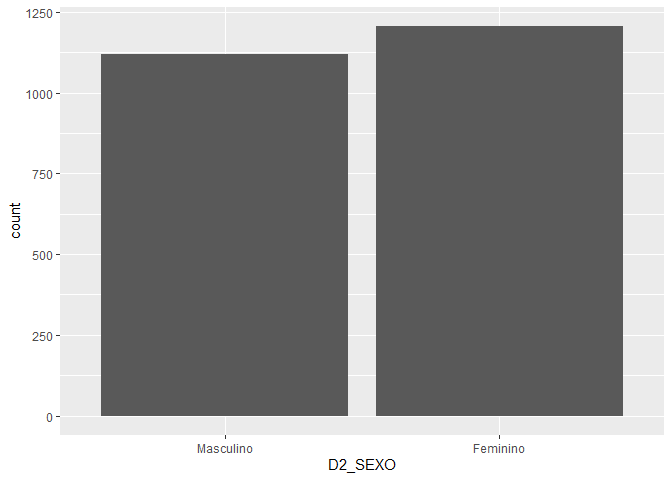
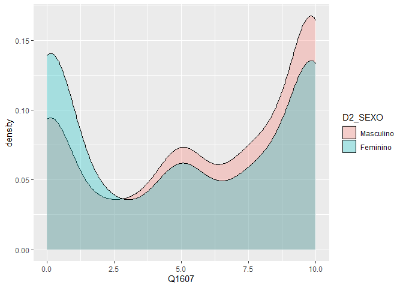
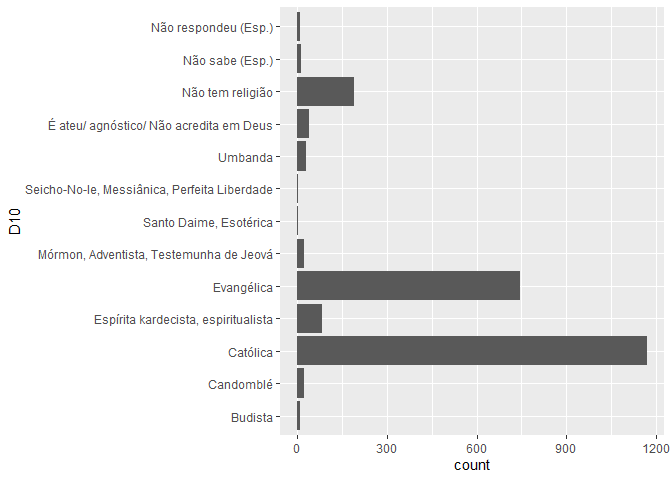
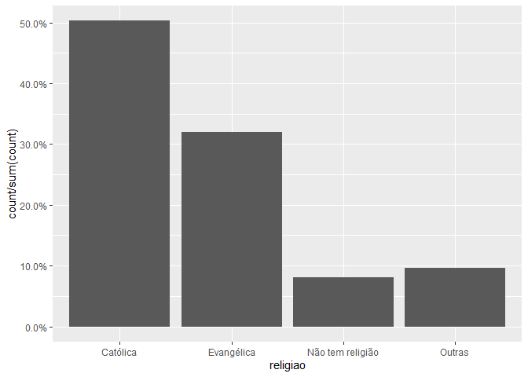
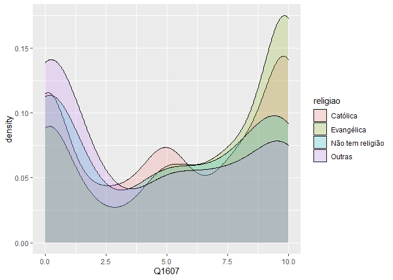
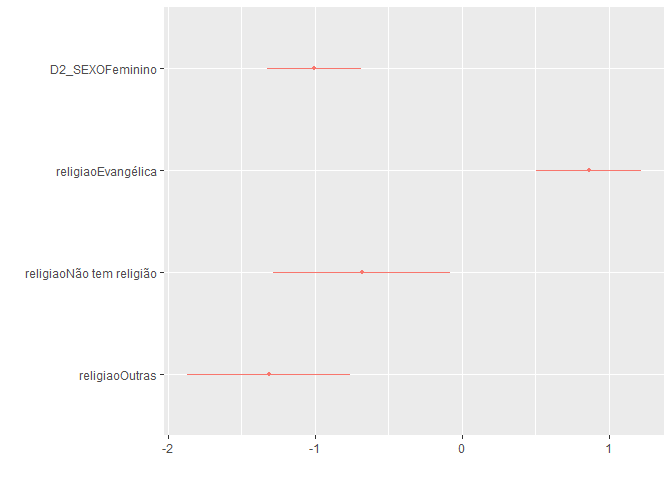

Exercício 8
================
Alune

### Continuaremos com a utilização dos dados do ESEB2018. Carregue o banco da mesma forma que nos exercicios anteriores

``` r
library(tidyverse)
library(haven)
library(scales)
library(dotwhisker)

link <- "https://github.com/MartinsRodrigo/Analise-de-dados/blob/master/04622.sav?raw=true"

download.file(link, "04622.sav", mode = "wb")

banco <- read_spss("04622.sav") 

banco <- banco %>%
  mutate(D2_SEXO = as_factor(D2_SEXO),
         D10 = as_factor(D10)) %>%
  filter(Q1607 < 11)
```

### Começaremos a utilizar no modelo de regressão variáveis qualitativas/categóricas. A primeira delas é sexo (D2\_SEXO). Represente esta variável graficamente.

``` r
ggplot(banco, aes(D2_SEXO)) + geom_bar()
```

<!-- -->

### Represente graficamente a associação entre sexo e nota atribuida a Bolsonaro (Q1607)

``` r
ggplot(banco, aes(Q1607, fill = D2_SEXO)) + geom_density(alpha = 0.3)
```

<!-- -->

### Teste a associação entre sexo e aprovação de Bolsonaro. Qual é sua conclusão?

``` r
t.test(Q1607~D2_SEXO, data = banco)
```

    ## 
    ##  Welch Two Sample t-test
    ## 
    ## data:  Q1607 by D2_SEXO
    ## t = 5.88, df = 2324, p-value = 4.693e-09
    ## alternative hypothesis: true difference in means is not equal to 0
    ## 95 percent confidence interval:
    ##  0.6392909 1.2790608
    ## sample estimates:
    ## mean in group Masculino  mean in group Feminino 
    ##                6.020536                5.061360

A partir do teste T é possível observar que as médias na avaliação do
candidato Bolsonaro entre homens é quase um ponto maior que entre as
mulheres. O valor T foi razoável (5.88) e o p-valor foi baixo. Esses
dados apontam para uma associação entre as duas variáveis.

### Faça uma regressão bivariada com estas duas variáveis, verificando em que medida sexo explica a nota atribuida a Bolsonaro. Interprete o resultado da regressão (o \(\beta\), o \(\alpha\), p-valores e medidas de desempenho do modelo)

``` r
regressao <- lm(Q1607~D2_SEXO, data = banco)

summary(regressao)
```

    ## 
    ## Call:
    ## lm(formula = Q1607 ~ D2_SEXO, data = banco)
    ## 
    ## Residuals:
    ##     Min      1Q  Median      3Q     Max 
    ## -6.0205 -4.0614 -0.0205  3.9795  4.9386 
    ## 
    ## Coefficients:
    ##                 Estimate Std. Error t value Pr(>|t|)    
    ## (Intercept)       6.0205     0.1178  51.112  < 2e-16 ***
    ## D2_SEXOFeminino  -0.9592     0.1636  -5.863 5.18e-09 ***
    ## ---
    ## Signif. codes:  0 '***' 0.001 '**' 0.01 '*' 0.05 '.' 0.1 ' ' 1
    ## 
    ## Residual standard error: 3.942 on 2324 degrees of freedom
    ## Multiple R-squared:  0.01458,    Adjusted R-squared:  0.01415 
    ## F-statistic: 34.38 on 1 and 2324 DF,  p-value: 5.178e-09

``` r
confint(regressao)
```

    ##                     2.5 %     97.5 %
    ## (Intercept)      5.789550  6.2515214
    ## D2_SEXOFeminino -1.279962 -0.6383893

A partir da regressão podemos concluir que as entrevistadas do sexo
feminino tendem a avaliar o candidato Bolsonaro quase um ponto a menos
que os entrevistados do sexo masculino, mais especificamente -0.9592. O
intercepto está localizado em 6.02 (média de avaliação entre os homens),
O p-valor baixo e o erro padrão baixo garantem certa confiança para tal
afirmação.

### Outra variável categórica bastante presente no debate sobre voto na última eleição é religião (D10). Represente esta variável graficamente.

``` r
ggplot(banco, aes(,D10)) + geom_bar ()
```

<!-- -->

### Crie no banco de dados uma variável de religião modificada chamada `religiao` com as categorias “Evangélica”, “Católica”, “Não tem religião”, e agregue todas as outras na categoria “Outras”.

``` r
Outras <- levels(banco$D10)[-c(3,5,13)]

banco <- banco %>%
  mutate(religiao = case_when(D10 %in% Outras ~ "Outras",
                              D10 == "Católica" ~ "Católica",
                              D10 == "Evangélica" ~ "Evangélica",
                              D10 == "Não tem religião" ~ "Não tem religião"))


ggplot(banco, aes(religiao, ..count../sum(..count..) )) +
  geom_bar() +
  scale_y_continuous(labels = percent)
```

<!-- -->

### Represente graficamente a associação entre religiao e nota atribuida a Bolsonaro

``` r
ggplot(banco, aes(Q1607,  fill=religiao)) + geom_density(alpha = 0.2) 
```

<!-- -->

### Para fazer o teste estatistico da associação entre as variáveis, não podemos usar o teste-t pois neste caso a variável categórica possui diversos níveis. O adequado é utilizar o teste de ANOVA ou o teste de Kruskal. Abaixo ilustramos como fazer esse teste. O Kruskal-test indica se há diferença entre alguma das categorias da variável e a variável contínua, mas não especifica como as diferentes categorias se diferenciam. Isso pode ser obtido com o teste de Wilcox, que compara os agrupamentos par a par. Como você interpreta esse resultado?

``` r
kruskal.test(Q1607 ~ religiao, data = banco)
```

    ## 
    ##  Kruskal-Wallis rank sum test
    ## 
    ## data:  Q1607 by religiao
    ## Kruskal-Wallis chi-squared = 61.013, df = 3, p-value = 3.571e-13

``` r
pairwise.wilcox.test(banco$Q1607, banco$religiao,
                     p.adjust.method = "BH")
```

    ## 
    ##  Pairwise comparisons using Wilcoxon rank sum test with continuity correction 
    ## 
    ## data:  banco$Q1607 and banco$religiao 
    ## 
    ##                  Católica Evangélica Não tem religião
    ## Evangélica       7.4e-06  -          -               
    ## Não tem religião 0.043    8.3e-06    -               
    ## Outras           1.2e-05  4.4e-11    0.126           
    ## 
    ## P value adjustment method: BH

O teste de Kruskal apresenta um resultado de chi-quadrado
consideravelmente alto o que indica que há uma diferença entre as
categorias da variável religião. Já o pairwise.wilcox.test demontra que
a há uma diferença estatística significande entre todas as variáveis,
menos entre aqueles que não tem religião e os que professam outra
religião que não católica e evangélica. É possível tirar essa conclusão
através do alto p-valor (0.12) da comparação.

### Faça uma regressão linear para verificar em que medida religião explica a avaliação de Bolsonaro. Interprete o resultado da regressão (cada um dos \(\beta\)s, o \(\alpha\), p-valores e medidas de desempenho do modelo)

``` r
regressao2 <- lm(Q1607 ~ religiao, data = banco)

summary(regressao2)
```

    ## 
    ## Call:
    ## lm(formula = Q1607 ~ religiao, data = banco)
    ## 
    ## Residuals:
    ##    Min     1Q Median     3Q    Max 
    ## -6.259 -4.107  0.559  3.741  5.893 
    ## 
    ## Coefficients:
    ##                          Estimate Std. Error t value Pr(>|t|)    
    ## (Intercept)                5.4410     0.1146  47.470  < 2e-16 ***
    ## religiaoEvangélica         0.8184     0.1838   4.452 8.93e-06 ***
    ## religiaoNão tem religião  -0.6325     0.3081  -2.053   0.0402 *  
    ## religiaoOutras            -1.3339     0.2859  -4.665 3.26e-06 ***
    ## ---
    ## Signif. codes:  0 '***' 0.001 '**' 0.01 '*' 0.05 '.' 0.1 ' ' 1
    ## 
    ## Residual standard error: 3.921 on 2322 degrees of freedom
    ## Multiple R-squared:  0.0261, Adjusted R-squared:  0.02484 
    ## F-statistic: 20.74 on 3 and 2322 DF,  p-value: 2.936e-13

A regressão utilizou de categoria de referência a variável “católico”,
isso significa que os valores do alpha devem ser levados em conta se
comparados à essa variável. O intercepto (5.4410) representa a média de
avaliação dos católicos para o candidato Bolsonaro. É possiível observar
a apartir dos coeficientes que há uma tendencia de uma melhor avaliação
do candidato entre os evangélicos (0.81), em contraposição a uma
avaliação pior por parte dos “sem religião” (-0.63) e, principalmente,
das pessoas que compõem o grupos das outras religiões (-1.33). Tais
resultados tem relevância estatística, como é possível observar a partir
do p-valor das regressões. D mesma forma é possível observar a partir
dos erros padrões de cada alpha que a tendência negativa ou positiva (em
comparação aos católicos) é confirmada dentro da margem de erro.

### Faça uma regressao linear avaliando ao mesmo tempo em que medida religiao e sexo explicam a avaliacao de Bolsonaro. Interprete o resultado de cada um dos coeficientes a partir da representação gráfica destes.

``` r
regressao3 <- lm(Q1607 ~ D2_SEXO + religiao, data = banco)

summary(regressao3)
```

    ## 
    ## Call:
    ## lm(formula = Q1607 ~ D2_SEXO + religiao, data = banco)
    ## 
    ## Residuals:
    ##     Min      1Q  Median      3Q     Max 
    ## -6.8130 -3.9448  0.1915  3.7365  6.3682 
    ## 
    ## Coefficients:
    ##                          Estimate Std. Error t value Pr(>|t|)    
    ## (Intercept)                5.9493     0.1401  42.477  < 2e-16 ***
    ## D2_SEXOFeminino           -1.0045     0.1616  -6.215 6.07e-10 ***
    ## religiaoEvangélica         0.8637     0.1825   4.732 2.36e-06 ***
    ## religiaoNão tem religião  -0.6813     0.3057  -2.229   0.0259 *  
    ## religiaoOutras            -1.3130     0.2837  -4.629 3.88e-06 ***
    ## ---
    ## Signif. codes:  0 '***' 0.001 '**' 0.01 '*' 0.05 '.' 0.1 ' ' 1
    ## 
    ## Residual standard error: 3.889 on 2321 degrees of freedom
    ## Multiple R-squared:  0.04204,    Adjusted R-squared:  0.04039 
    ## F-statistic: 25.46 on 4 and 2321 DF,  p-value: < 2.2e-16

``` r
dwplot(regressao3)
```

<!-- -->

A partir do gráfico é possível observar visualmente a correlação
negativa entre as categorias “sexo feminino”, “outras religiões e”sem
religião" se comparados ao intercepto da avaliação do candidato
Bolsonaro (5.94). Também é possível observar o que o
pairwise.wilcox.test já havia demonstrado: que as categorias “sem
religião” e outras religiões" se sobrepõem, não possuindo relevância
estatística. Por fim se destaca o apoio evangélico ao candidato
Bolsonaro, bem acima do intercepto.
